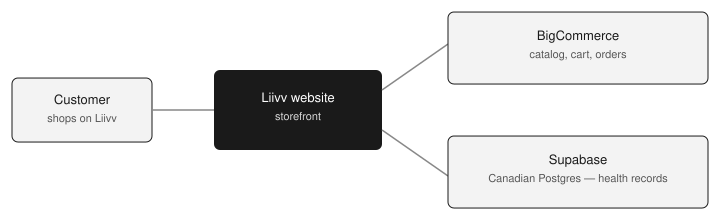

# How Liivv works

How the store engine and health locker fit together, and how a paid Canadian medical-server plan protects PHI.

---

## The one-sentence version

Liivv is a health storefront with **two separate engines**:

- **BigCommerce** runs the shop (the same kind of product as Shopify).
- **Supabase** holds health records in a paid Canadian vault.

Orders never live in the health locker. Health records never live in the shop.

The customer only sees Liivv. Behind the website, shopping and health information take different doors on purpose.

| Job | Who does it | Simple analogy |
| --- | --- | --- |
| Show products, take the cart, create the order | BigCommerce | The shop floor and the till |
| Remember health needs, insurance, prescriptions, care chat | Supabase | A locked filing cabinet in Canada |
| Charge the card, including repeating subscriptions | Stripe | The bank — we never see the card number |

A store is built to sell products. A clinic-style locker is built to keep sensitive health information. Using one system for both would be like keeping medical files in a cash register.

---

## BigCommerce is the only store engine

If you already know Shopify, you already know the idea. BigCommerce is the same kind of product: a ready-made commerce platform that owns the catalog, the cart, the customer login, and the order.

Liivv does not invent a second checkout. We do not process orders ourselves.

**What BigCommerce handles**

- The product catalog, prices, and categories
- The cart and checkout path
- Customer accounts used to sign in
- The official order after payment succeeds

**What it is not used for**

- Health questionnaires or care needs
- Insurance details
- Prescriptions, refills, or CarePack requests
- Conversations with the care team

**Talking point:** There is one commerce engine, the way a typical brand has one Shopify store. BigCommerce is that engine. Everything about buying and fulfilling an order lives there.

### Recurring orders

Stripe handles the repeating charge. When a renewal succeeds, Liivv still creates the order in BigCommerce. Stripe is the billing engine. BigCommerce remains the only order engine. Notes about what is on a subscription can sit in Supabase; the order itself does not.

---

## What Supabase is

Supabase is a rented, professionally run database. In plain language: it is a secure place on the internet where Liivv keeps records that a shop is not meant to hold.

- **A filing cabinet.** Information sits in tables — like labeled folders — instead of in the shopping cart software.
- **A photo vault.** Files such as a prescription image can be stored privately, not on the public website.
- **Not a second store.** Supabase does not take payments or create orders. It only holds the health side of the account.

**Why we need it.** BigCommerce is excellent at selling. It is not a medical records system. Health information needs its own locker, with its own location, contract, and locks. That locker is Supabase.

The customer never talks to Supabase directly. Liivv’s website is the only front door. Keys stay on our server, not in the browser — the same way a bank app talks to the bank, not to the customer’s phone files.

---

## What kind of information lives in Supabase

Not the shopping list. Not the credit card. Broadly, anything that helps Liivv care for the person behind the order.

| Kind of information | In everyday words | Why it is here |
| --- | --- | --- |
| Health profile | What kind of care they need, in general terms | So the account can be useful, not generic |
| Insurance | Coverage details so claims can be handled | Pharmacy / benefits workflow — not a store feature |
| Prescriptions and refill requests | What they need filled, and requests to refill it | Staff review this; it is clinical work, not a cart |
| Care conversations | Messages with the care team | Those chats can include health context |
| Account link | Which shopper this health file belongs to | Connects the locker to the BigCommerce login |

**What does not live here**

- **Orders.** The official order record stays in BigCommerce. That is the store’s job.
- **Card numbers.** Payments go through Stripe. Liivv never stores the card itself.
- **The catalog.** Products and prices stay in BigCommerce. Supabase is not a second inventory system.

**Talking point:** Think “health file,” not “spreadsheet of every field.” If it is about the person’s care, it belongs in Supabase. If it is about buying something, it belongs in BigCommerce.

### Chat assistant

Care conversations already live in Supabase. An on-site assistant can help with products, orders, and account how-tos when we turn it on. It is not a clinician and does not give medical advice.

If the OpenAI connection is on, those messages can leave our Canadian locker to that vendor. That stays off until the legal paperwork is in place. Human care-team chat still stays in Supabase.

---

## How the medical server switch protects PHI

PHI means protected health information — anything that could identify a person and say something about their health.

The plan is a **paid Canadian Supabase project with healthcare mode turned on**. That is the “medical server switch.”

Three things we turn on:

1. **Paid plan** — Team (or Enterprise). Hobby plans cannot do this.
2. **Canada** — servers in Canada (Montreal region).
3. **Healthcare mode** — extra locks plus a legal contract.

| The control | In simple terms | What it protects against |
| --- | --- | --- |
| Canadian region | The locker sits in Canada, not on a default US server | Health files leaving the country by accident |
| HIPAA add-on + signed BAA | A legal contract: Supabase must help protect this data | A vendor with no duty of care |
| High Compliance switch | The dashboard setting that puts the project in healthcare mode | A normal database with hobby-grade settings |
| Encryption | The file is locked while stored and while moving | Someone reading the data in transit or on disk |
| Network restrictions | Only Liivv’s servers can knock on the vault door | Random internet traffic reaching the database |
| SSL required | Connections must be encrypted — no “open line” | Unprotected connections into the database |
| Point-in-time recovery | We can rewind the locker if something goes wrong | Accidental deletes or a bad change |
| Connection logging | A record of who connected and when | Silent access with no trail |

**The apartment vs. the vault.** A free or basic database is like a shared apartment. The paid Canadian healthcare plan is like a bank vault in Montreal: a contract, a locked room, cameras, and a rule that only our staff’s systems get a key.

### A note on the word HIPAA

HIPAA is a US health-privacy law. Canada’s equivalent conversation is PIPEDA, and in Ontario, PHIPA. We still use Supabase’s healthcare switch because that is the healthcare-grade package they sell: extra security, a signed agreement, and Canadian data residency. It is the practical way to treat this as medical data on this platform — not a claim that US law is the Canadian statute.

**What the switch does not replace.** The vault is only as good as how we use it. Liivv still decides who on the team can see a file, how long we keep it, and that chat or photos are not copied into tools that are not covered. The switch locks the building. We still lock the rooms.
