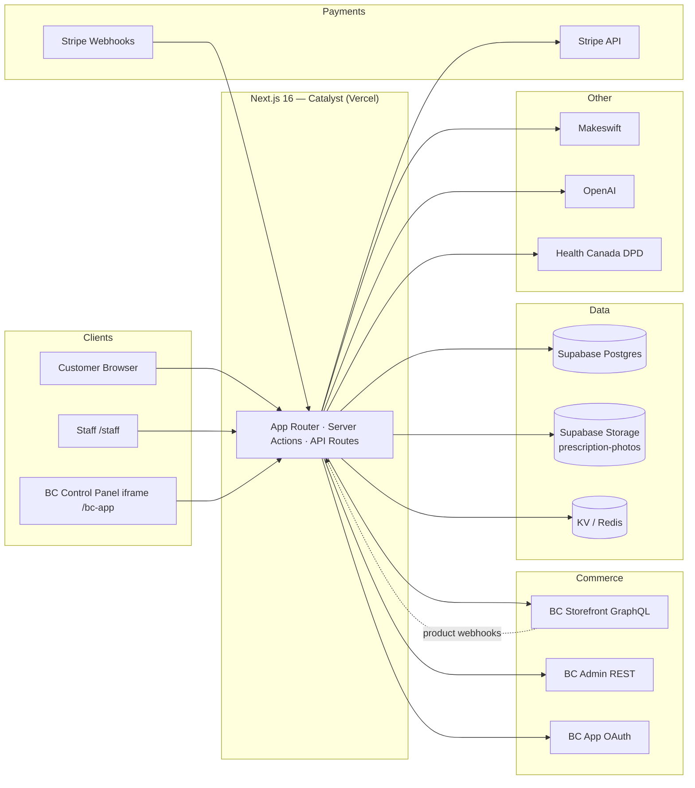
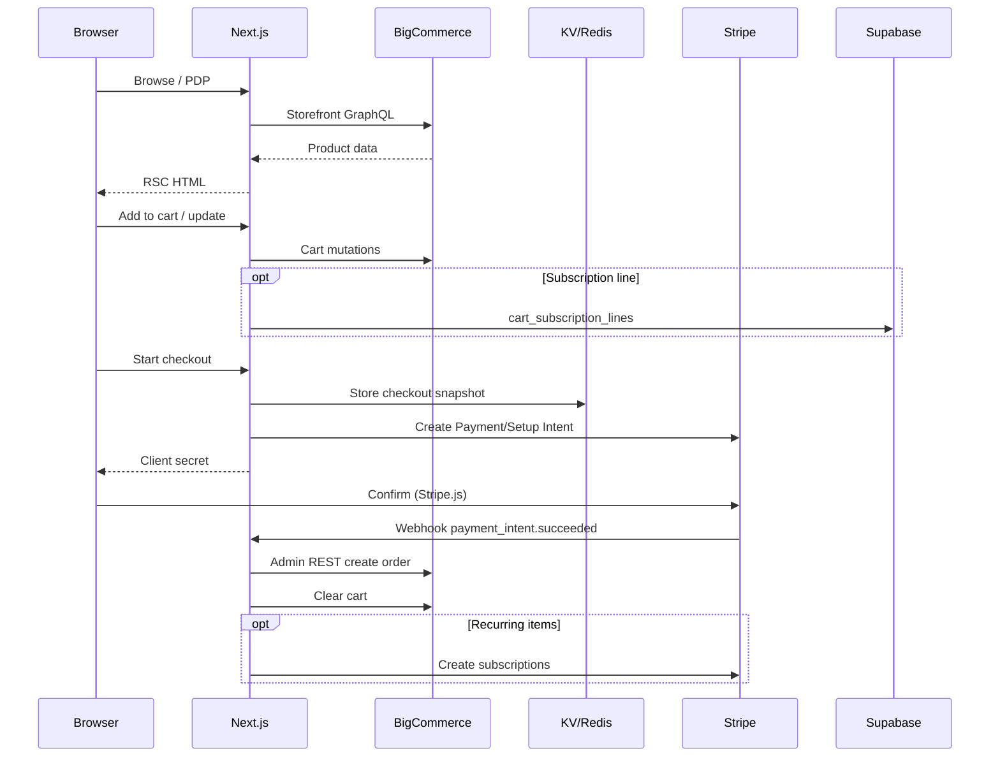
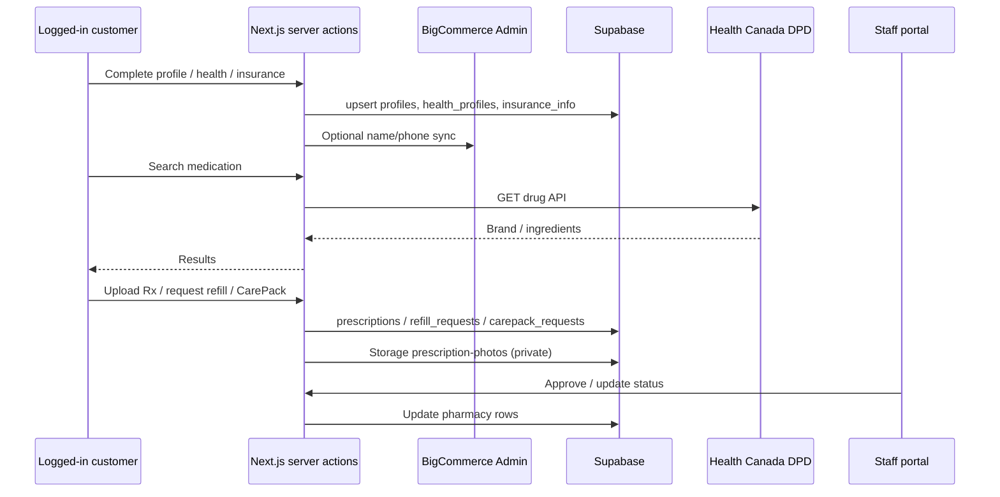
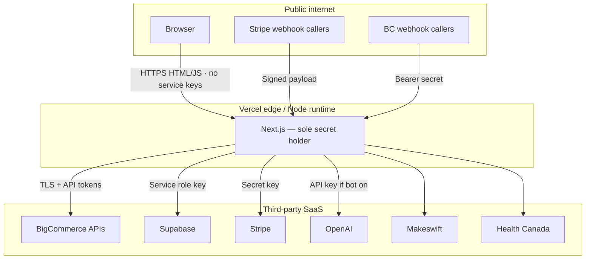

# Liivv Marketplace — IT Architecture Diagram Pack

**Audience:** IT security & infrastructure review (IT-01 / IT-02)  
**App:** BigCommerce Catalyst storefront (`core/`) + Liivv health/pharmacy extensions  
**Date:** July 2026  
**Status:** Draft for IT review meeting

---

## 1. Executive summary

Liivv is a **headless e-commerce + virtual care** application:

| Layer | Technology | Role |
|-------|------------|------|
| Storefront | **Next.js 16** (App Router, RSC) on **Vercel** | Only app that holds secrets; renders UI; runs server actions & webhooks |
| Commerce | **BigCommerce** | Catalog, cart GraphQL, customers, Admin REST orders |
| CMS | **Makeswift** | Marketing / content pages |
| Clinical & account data | **Supabase** (Postgres + Storage) | Profiles, health, insurance, pharmacy, chat |
| Payments | **Stripe** | Checkout, subscriptions, webhooks |
| AI assistant | **OpenAI** (optional, feature-flagged) | Virtual care chat bot |
| Drug reference | **Health Canada DPD** | Medication search (server proxy) |
| Ephemeral cache | **Upstash Redis / Vercel KV** | Checkout snapshots, BC app install token |

**Design principle:** browsers never receive service-role, admin, or payment secrets. Next.js is the trust boundary.

---

## 2. System context diagram



---

## 3. System of record (ownership)

| Domain | System of record | Notes |
|--------|------------------|-------|
| Products, categories, prices | BigCommerce | Synced to Stripe prices via BC webhooks |
| Customers (login identity) | BigCommerce | Linked in Supabase `profiles.bigcommerce_customer_id` |
| Cart / checkout cart | BigCommerce GraphQL | Cart ID stored in signed Auth.js / anonymous JWT |
| Orders | BigCommerce | Created via Admin REST after Stripe success |
| Payment methods & subscriptions | Stripe | Renewals create BC orders on `invoice.paid` |
| Health profile, insurance | Supabase | Not modeled in BC |
| Prescriptions, CarePack, refills | Supabase | Staff queue in /staff or /bc-app |
| Live chat messages | Supabase | Optional OpenAI bot replies |
| Marketing page content | Makeswift | Hosted via Catalyst Makeswift integration |

---

## 4. Data flow — commerce



---

## 5. Data flow — onboarding & pharmacy



---

## 6. Data flow — virtual care chat

```mermaid
sequenceDiagram
  participant U as Customer widget
  participant N as Next.js
  participant SB as Supabase
  participant AI as OpenAI
  participant Staff as Staff UI

  U->>N: Send message
  N->>SB: append chat_messages
  alt Bot enabled AND care team not active
    N->>AI: Chat Completions + tools
    AI-->>N: Reply / escalate
    N->>SB: bot message; maybe escalate flag
  end
  Staff->>N: Join / reply / close
  N->>SB: staff messages; pause bot while staff active
  Note over U,N: UI polls for new messages (not Realtime yet)
```

---

## 7. Authentication boundaries

| Plane | Mechanism | Cookie | Secret | Path / lifetime |
|-------|-----------|--------|--------|-----------------|
| Customer | NextAuth → BC GraphQL login or Customer Login JWT | Auth.js session JWT | `AUTH_SECRET` | Site-wide |
| Anonymous cart | Signed JWT containing `cartId` | `authjs.anonymous-session-token` | `AUTH_SECRET` | 7 days |
| Staff password | Shared password + HMAC | `liiv_staff` | `ADMIN_DASHBOARD_PASSWORD`, `ADMIN_SESSION_SECRET` | `/staff`, 7 days |
| BC embedded app | OAuth install + signed load | `liivv_bc_app` | `BIGCOMMERCE_APP_CLIENT_SECRET` | `/bc-app`, 12 hours |

Staff features are available if **either** password session **or** valid BC app session for the configured store is present.

**Webhooks**

- Stripe: `stripe.webhooks.constructEvent` + `STRIPE_WEBHOOK_SECRET`
- BigCommerce: `Authorization: Bearer` + `BIGCOMMERCE_WEBHOOK_SECRET`

---

## 8. Network & trust boundary (security sketch)



### Secrets inventory (server-only unless noted)

| Secret | Purpose |
|--------|---------|
| `AUTH_SECRET` | Auth.js + anonymous cart JWT |
| `BIGCOMMERCE_STOREFRONT_TOKEN` | Storefront GraphQL |
| `BIGCOMMERCE_ACCESS_TOKEN` | Admin REST (orders, customers) |
| `BIGCOMMERCE_CLIENT_ID` / `CLIENT_SECRET` | Customer Login API JWT |
| `BIGCOMMERCE_WEBHOOK_SECRET` | Product → Stripe sync |
| `BIGCOMMERCE_APP_CLIENT_ID` / `SECRET` | Embedded staff app |
| `STRIPE_SECRET_KEY` / `STRIPE_WEBHOOK_SECRET` | Payments |
| `NEXT_PUBLIC_STRIPE_PUBLISHABLE_KEY` | **Public** — Stripe.js only |
| `SUPABASE_URL` / `SUPABASE_SERVICE_ROLE_KEY` | DB + Storage (bypasses RLS) |
| `ADMIN_DASHBOARD_PASSWORD` / `ADMIN_SESSION_SECRET` | Staff portal |
| `OPENAI_API_KEY` | Virtual care bot |
| `MAKESWIFT_SITE_API_KEY` | CMS |

---

## 9. Security review findings

| ID | Finding | Risk | Recommendation |
|----|---------|------|----------------|
| S1 | Supabase uses **service role only**; shipped SQL has **no RLS** | High | Enable RLS + restricted roles, or formally accept app-layer auth; lock network to Vercel egress if possible |
| S2 | Health / Rx / chat / Rx photos in Supabase | High | Confirm region, encryption, retention, BAAs; verify private bucket + short-lived signed URLs |
| S3 | Shared staff password (`ADMIN_DASHBOARD_PASSWORD`) | Med | Prefer BC-app-only or SSO; rotate; consider IP allowlist |
| S4 | OpenAI may process chat when bot enabled | Med | Keep flag off until DPA/BAA; redact PHI; escalate clinical to human |
| S5 | Many high-value env secrets | Med | Encrypted env per environment; rotate on personnel change; never commit `.env` |
| S6 | Makeswift / BC iframe need `SameSite=None; Secure` cookies | Med | Review CSP allowlists; HTTPS only |
| S7 | Customer email largely via BigCommerce | Low | Confirm transactional email ownership & branding |
| S8 | DPD public API proxied without auth | Low | Rate-limit `/api/medications/*` |

### Controls already implemented

- Privileged work in Server Components / server actions (not client-held tokens)
- Stripe & BC webhook verification
- Timing-safe staff password compare + HMAC cookies
- BC app session bound to store hash
- Cart ID inside signed JWT
- Virtual care bot disabled unless `VIRTUAL_CARE_BOT_ENABLED=true`

---

## 10. Compliance & data classification (for IT discussion)

| Data class | Examples | Storage |
|------------|----------|---------|
| PII | Name, email, address, BC customer id | BC + Supabase `profiles` |
| PHI / PHI-adjacent | Health categories, insurance, Rx, CarePack, chat | Supabase (+ Storage for photos) |
| Payment card data | PAN / CVC | **Never stored** — Stripe Elements / PCI SAQ-A style flow |
| Commerce | Orders, SKUs, prices | BigCommerce (+ Stripe for billing) |

**Open questions for IT**

1. Is Supabase project region acceptable for Canadian health data expectations?
2. Are vendor BAAs required for Supabase, Stripe, OpenAI, Vercel, BigCommerce?
3. Logging policy: ensure request logs do not print Rx images or chat bodies.
4. Backup / RPO for Supabase Storage (`prescription-photos`).
5. Staff access: shared password acceptable for UAT only, or production blocker?

---

## 11. Suggested IT meeting agenda (IT-02)

1. Walk system context diagram (this doc §2)
2. Confirm systems of record (§3)
3. Deep-dive pharmacy & chat PHI path (§5–6)
4. Auth planes & staff access model (§7)
5. Review findings S1–S8; assign owners (§9)
6. Agree egress allowlists / secrets management
7. Sign-off criteria for production (feeds IT-03 / IT-04)

---

## 12. Key evidence paths (code)

```
core/package.json
core/.env.example
core/auth/index.ts
core/lib/supabase/client.ts
core/lib/supabase/onboarding-schema.sql
core/lib/supabase/pharmacy-schema.sql
core/lib/admin-auth.ts
core/lib/bc-app-session.ts
core/lib/stripe/webhook-handlers.ts
core/lib/virtual-care-bot/
core/app/api/stripe/webhook/route.ts
core/app/api/bigcommerce/webhook/route.ts
core/app/api/bigcommerce/app/{auth,load,uninstall}/route.ts
core/app/staff/
core/app/bc-app/
```

---

*Prepared for IT-01 (Prepare Architecture Diagram for IT). Companion interactive walkthrough: Cursor canvas `liivv-it-architecture.canvas.tsx`.*
