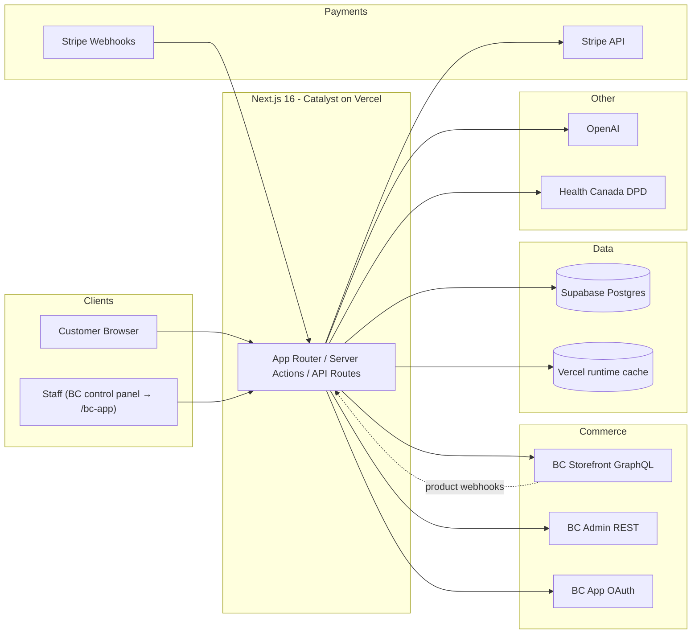
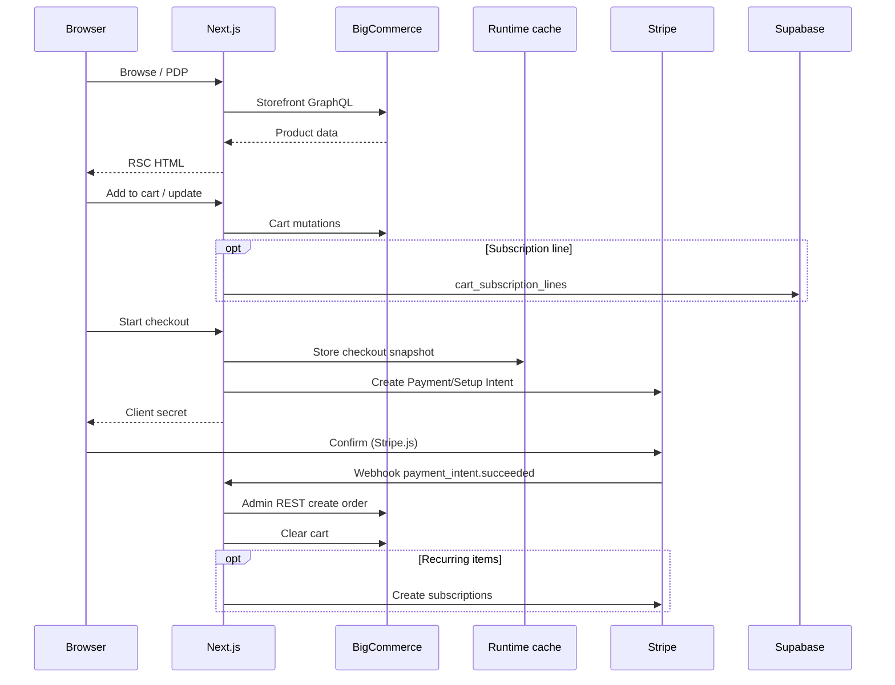
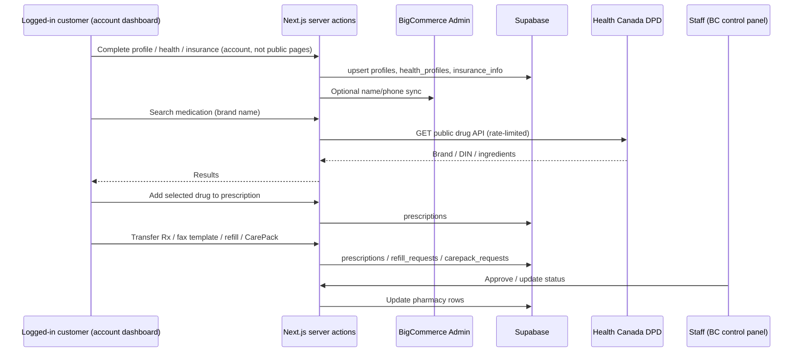
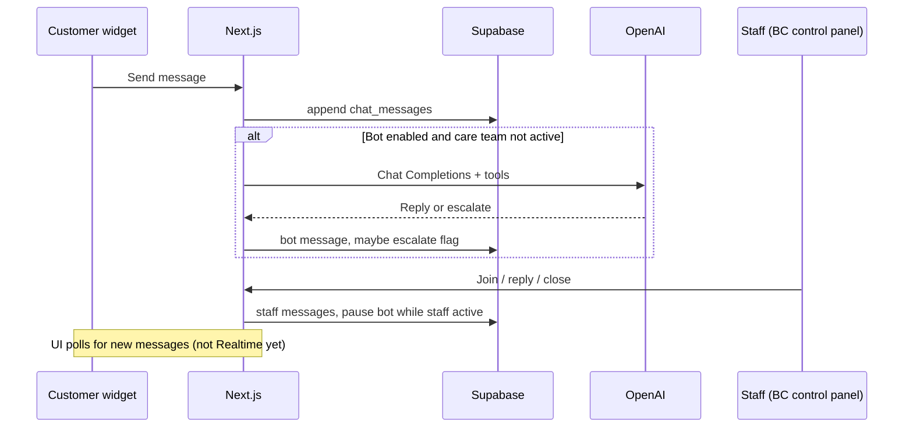
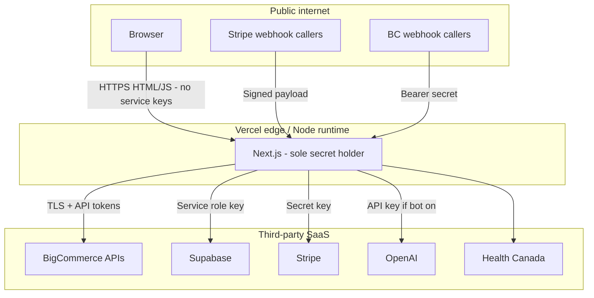

# Liivv — Architecture Deep Dive

**Audience:** Product, ops, and engineering  
**App:** BigCommerce Catalyst storefront (`core/`) + Liivv health and pharmacy extensions  
**Date:** August 2026  
**Status:** Current  
**Overview:** [Liivv-Architecture.md](./Liivv-Architecture.md) — product-shaped summary of the same system  
**PDF:** [Liivv-Architecture-Deep-Dive.pdf](./Liivv-Architecture-Deep-Dive.pdf) (same content, for email / print)

Reading map:

- **§1–§2** — systems of record, `/bc-app`, system context  
- **§3–§5** — data flows (commerce, onboarding/pharmacy, care chat)  
- **§6** — security controls (S1–S8)  
- **§7–§9** — auth, trust boundary, secrets, evidence paths  

Assumes the [overview](./Liivv-Architecture.md): two engines (BigCommerce shop vs Canadian Supabase health records), Next.js on Vercel as the trust boundary, Stripe for cards, no Rx photo uploads.

---

## 1. System of record

| Domain | System of record | Notes |
| --- | --- | --- |
| Products, categories, prices | BigCommerce | Synced to Stripe prices via BC webhooks |
| Customers (login identity) | BigCommerce | Linked in Supabase `profiles.bigcommerce_customer_id` |
| Cart / checkout cart | BigCommerce GraphQL | Cart ID stored in signed Auth.js / anonymous JWT |
| Orders | BigCommerce | Created via Admin REST after Stripe success |
| Payment methods & subscriptions | Stripe | Renewals create BC orders on `invoice.paid` |
| Health profile, insurance | Supabase | Not modeled in BC |
| Prescriptions, CarePack, refills | Supabase | Staff queue in `/bc-app` |
| Live chat messages | Supabase | Optional OpenAI bot replies (flagged off) |

**Recurring orders:** Stripe handles the repeating charge. When a renewal succeeds, Liivv still creates the order in BigCommerce. Stripe is the billing engine. BigCommerce remains the only order engine.

**Chat assistant:** Care conversations live in Supabase. If `VIRTUAL_CARE_BOT_ENABLED=true` and an API key is set, **customer message text is sent to OpenAI** even when the bot refuses clinical advice and points people to a pharmacist. That flag stays **false** until the team decides whether to buy an OpenAI arrangement that includes a **DPA**. Human care-team chat in `/bc-app` still stays in Supabase either way.

**Patients do not upload prescription photos.** Adding a prescription is **transfer from another pharmacy** or **doctor fax**. Staff work the queue in **`/bc-app`** (Liivv Staff).

**`/bc-app` (Liivv Staff):** pharmacy and care-team staff open it from the **BigCommerce control panel** → **Apps → My apps → Liivv Staff**. BigCommerce loads the app in an iframe using the **signed-in load token**. Tabs: **pharmacy** (prescription / refill / CarePack queues), **customers**, **chat**. Session cookie `liivv_bc_app` is scoped to `/bc-app` for 12 hours and bound to the store hash. `/staff` is 404. `/admin` only redirects to the BC control panel. Product-shaped summary: [overview §2](./Liivv-Architecture.md).

**Health Canada DPD:** the Drug Product Database is Health Canada’s **free public API** (open government data — no key, no paid contract). Liivv proxies it so customers can search licensed Canadian drugs by brand name and add the selected product to a prescription. The **prescription is stored in Supabase**. Search queries go to Health Canada; patient records do not. The proxy is rate-limited at 60 requests / IP / minute so Liivv is not used as an open relay.

**Hosting:** the Catalyst app (`core/`) runs on **Vercel** (production and preview). Next.js on Vercel is the only process that holds service-role, admin, and payment secrets. Secrets live in the Vercel project (encrypted) plus gitignored `.env.local` for local work. Checkout snapshots and the staff-app install token use **Vercel’s runtime cache** (in-memory locally).

---

## 2. System context



---

## 3. Data flow — commerce



---

## 4. Data flow — onboarding and pharmacy



---

## 5. Data flow — virtual care chat



---

## 6. Security controls (S1–S8)

Each item is a control so shopping, health data, staff access, and third-party APIs stay inside the intended boundaries.

| ID | Topic | If left unchecked | Status | Control |
| --- | --- | --- | --- | --- |
| **S1** | Who can query Supabase | High | **In place** | **Row Level Security** is on for public tables, with **no anon/authenticated policies** (deny by default). Browsers never receive a database key. Next.js uses the **service role** on the server only; that role bypasses RLS by design. |
| **S2** | Where health data lives | High | **In place** | Health profile, insurance, prescriptions, CarePack, and chat live in **Canadian** Supabase (`ca-central-1`) — not in BigCommerce. Patients add prescriptions by **transfer or doctor fax only**; we do not collect Rx photos. |
| **S3** | Staff access | Med | **In place** | Staff work inside **BigCommerce → Apps → Liivv Staff (`/bc-app`)**, using the store’s **signed-in load token** (BC app session). `/staff` is not a product surface (404). |
| **S4** | AI chat assistant | Med | **Off** | The assistant is **off** (`VIRTUAL_CARE_BOT_ENABLED=false`). If it were on, customer message text would go to OpenAI even when the reply is “talk to a pharmacist.” Human care-team chat in `/bc-app` stays in Supabase either way. |
| **S5** | Environment secrets | Med | **In place** | Secrets live in Vercel (encrypted) and in gitignored `.env.local`. Nothing privileged is committed. Rotate on personnel change. |
| **S6** | Embedded staff app frames | Med | **In place** | Staff work inside a BigCommerce control-panel iframe (`/bc-app`). Cookies used in that iframe are `SameSite=None; Secure` (partitioned where needed). CSP `frame-ancestors` is allowlisted, not open. |
| **S7** | Customer email | Low | **In place** | Password reset and most transactional mail are **BigCommerce’s**. The storefront only triggers reset via GraphQL. |
| **S8** | Medication search (Health Canada DPD) | Low | **In place** | Customers look up licensed Canadian drugs through Health Canada’s **free public DPD API** so they can add the right product to a prescription. Search is a **server proxy**, rate-limited at **60 requests / IP / minute**, so Liivv is not an open relay to Health Canada. The selected medication is saved on the **prescription in Supabase**. Queries to DPD are catalog lookups — not a patient-data path. |

### Additional controls

- Privileged work runs in Server Components / server actions (tokens never held in the browser)
- Stripe and BigCommerce webhooks are verified
- BC app session is bound to the store hash
- Cart ID is inside a signed JWT

---

## 7. Authentication boundaries

| Plane | Mechanism | Cookie | Secret | Path / lifetime |
| --- | --- | --- | --- | --- |
| Customer | NextAuth → BC GraphQL login or Customer Login JWT | Auth.js session JWT | `AUTH_SECRET` | Site-wide |
| Anonymous cart | Signed JWT containing `cartId` | `authjs.anonymous-session-token` | `AUTH_SECRET` | 7 days |
| Staff (BC app) | OAuth install + signed load | `liivv_bc_app` | `BIGCOMMERCE_APP_CLIENT_SECRET` | `/bc-app`, 12 hours |

`ENABLE_ADMIN_ROUTE` only redirects `/admin` to the BigCommerce control panel. It is **not** the pharmacy staff portal.

**Webhooks**

- Stripe: `stripe.webhooks.constructEvent` + `STRIPE_WEBHOOK_SECRET`
- BigCommerce: `Authorization: Bearer` + `BIGCOMMERCE_WEBHOOK_SECRET`

---

## 8. Network and trust boundary



### Secrets inventory (server-only unless noted)

| Secret | Purpose |
| --- | --- |
| `AUTH_SECRET` | Auth.js + anonymous cart JWT |
| `BIGCOMMERCE_STOREFRONT_TOKEN` | Storefront GraphQL |
| `BIGCOMMERCE_ACCESS_TOKEN` | Admin REST (orders, customers) |
| `BIGCOMMERCE_CLIENT_ID` / `CLIENT_SECRET` | Customer Login API JWT |
| `BIGCOMMERCE_WEBHOOK_SECRET` | Product → Stripe sync |
| `BIGCOMMERCE_APP_CLIENT_ID` / `SECRET` | Embedded staff app |
| `STRIPE_SECRET_KEY` / `STRIPE_WEBHOOK_SECRET` | Payments |
| `NEXT_PUBLIC_STRIPE_PUBLISHABLE_KEY` | **Public** — Stripe.js only |
| `SUPABASE_URL` / `SUPABASE_SERVICE_ROLE_KEY` | DB (bypasses RLS) |
| `OPENAI_API_KEY` | Virtual care bot (unused while flag is off) |

---

## 9. Key evidence paths (code)

```
core/package.json
.env.example
core/auth/index.ts
core/lib/supabase/client.ts
core/lib/supabase/onboarding-schema.sql
core/lib/supabase/pharmacy-schema.sql
core/lib/bc-app-session.ts
core/lib/staff-access.ts
core/lib/content-security-policy.ts
core/lib/pharmacy/medication-rate-limit.ts
core/lib/stripe/webhook-handlers.ts
core/lib/virtual-care-bot/
core/app/api/medications/
core/app/api/stripe/webhook/route.ts
core/app/api/bigcommerce/webhook/route.ts
core/app/api/bigcommerce/app/{auth,load,uninstall}/route.ts
core/app/bc-app/
```

---

*Companion walkthrough (if used):* `liivv-it-architecture.canvas.tsx`.  
*Product-shaped summary:* [Liivv-Architecture.md](./Liivv-Architecture.md).
