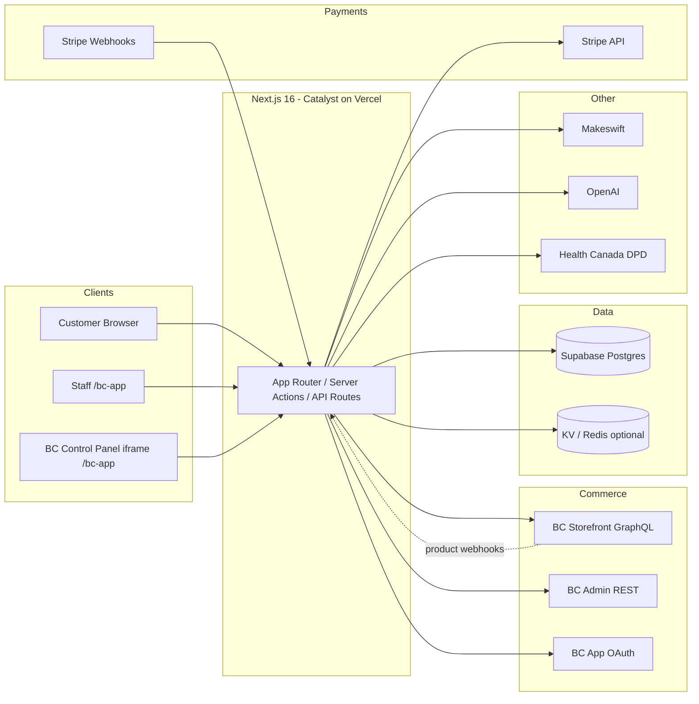
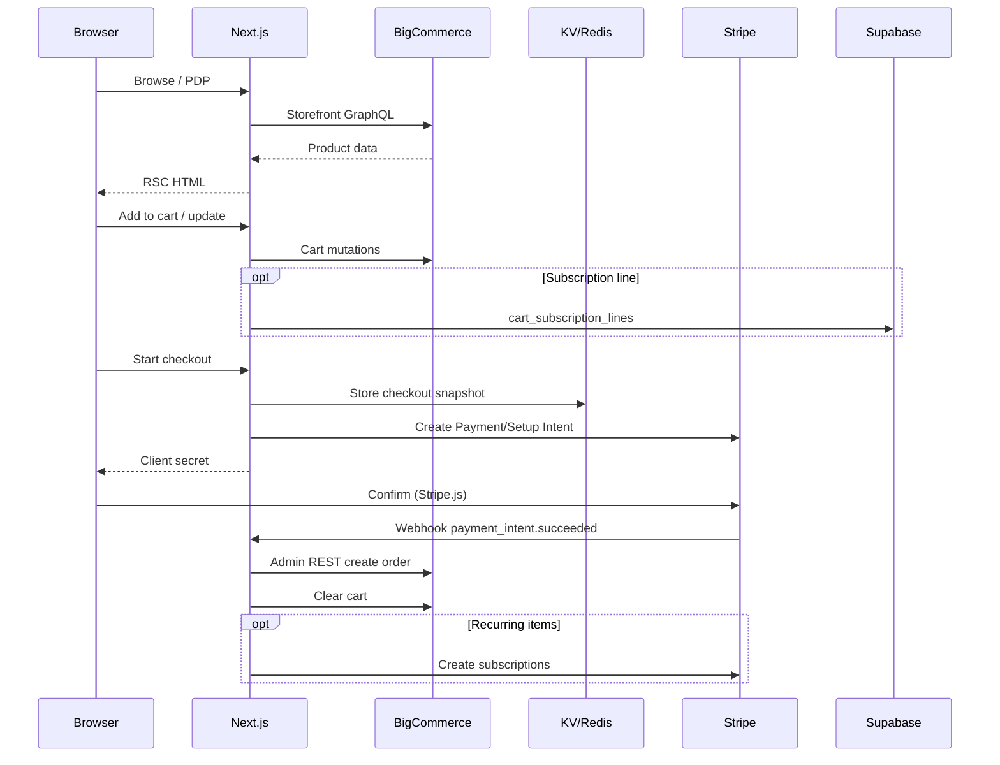
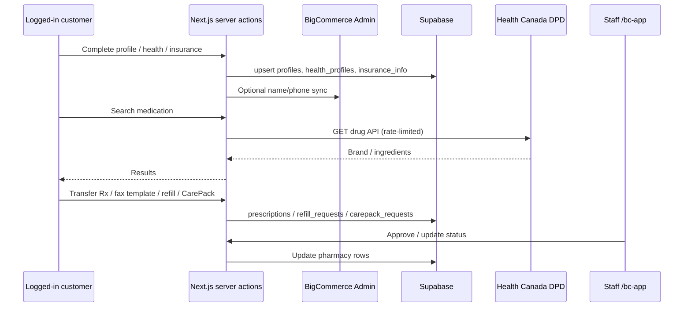
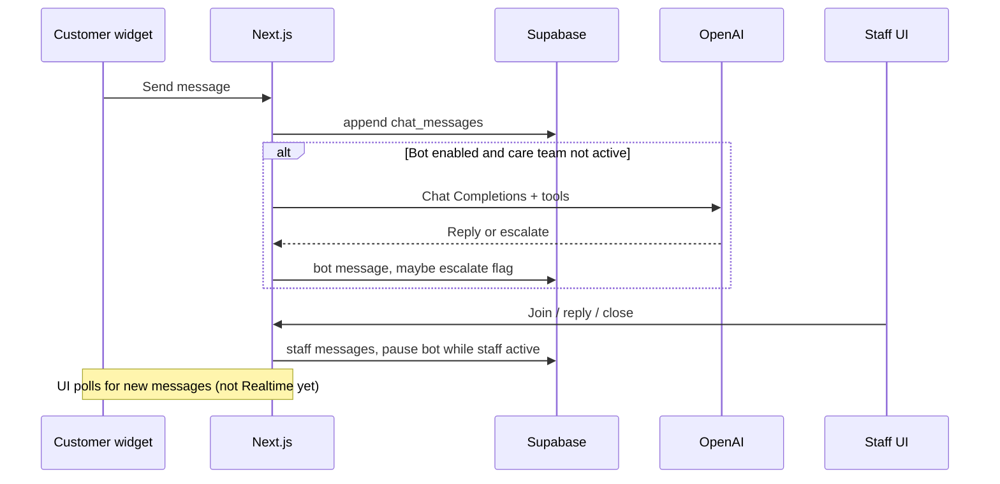
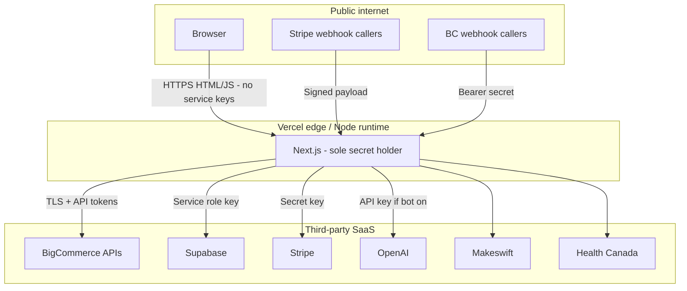

# Liivv — Architecture Deep Dive

**Audience:** Architecture and security review  
**App:** BigCommerce Catalyst storefront (`core/`) + Liivv health and pharmacy extensions  
**Date:** August 2026  
**Status:** Current  
**Overview:** [Liivv-Architecture.md](./Liivv-Architecture.md) — product-shaped summary of the same system  
**PDF:** [Liivv-Architecture-Deep-Dive.pdf](./Liivv-Architecture-Deep-Dive.pdf) (same content, for email / print)

Reading map:

- **§1–§2** — systems of record, system context  
- **§3–§5** — data flows (commerce, onboarding/pharmacy, care chat)  
- **§6** — pre-launch security checklist (S1–S8)  
- **§7–§11** — auth, trust boundary, secrets, remaining Legal/ops items, evidence paths  

Assumes the [overview](./Liivv-Architecture.md): two engines (BigCommerce shop vs Canadian Supabase health records), Next.js on Vercel as the trust boundary, Stripe for cards, no Rx photo uploads.

---

## 1. System of record

| Domain | System of record | Notes |
| --- | --- | --- |
| Products, categories, prices | BigCommerce | Synced to Stripe prices via BC webhooks |
| Customers (login identity) | BigCommerce | Linked in Supabase `profiles.bigcommerce_customer_id` |
| Cart / checkout cart | BigCommerce GraphQL | Cart ID stored in signed Auth.js / anonymous JWT |
| Orders | BigCommerce | Created via Admin REST after Stripe success |
| Payment methods & subscriptions | Stripe | Renewals create BC orders on `invoice.paid` |
| Health profile, insurance | Supabase | Not modeled in BC |
| Prescriptions, CarePack, refills | Supabase | Staff queue in `/bc-app` |
| Live chat messages | Supabase | Optional OpenAI bot replies (flagged off) |
| Marketing page content | Makeswift | Catalyst Makeswift integration |

**Recurring orders:** Stripe handles the repeating charge. When a renewal succeeds, Liivv still creates the order in BigCommerce. Stripe is the billing engine. BigCommerce remains the only order engine.

**Chat assistant:** Care conversations live in Supabase. If `VIRTUAL_CARE_BOT_ENABLED=true` and an API key is set, **customer message text is sent to OpenAI** even when the bot refuses clinical advice and points people to a pharmacist. That flag stays **false** until the team decides whether to buy an OpenAI arrangement that includes a **DPA**. Human care-team chat in `/bc-app` still stays in Supabase either way.

**Patients do not upload prescription photos.** Adding a prescription is **transfer from another pharmacy** or **doctor fax**. Staff work the queue in the BigCommerce embedded app (`/bc-app`).

**Upstash Redis** is not required for launch if Supabase is configured. It is optional hardening for checkout/webhooks, the staff-app install token, and site-wide medication rate limits.

---

## 2. System context



---

## 3. Data flow — commerce



---

## 4. Data flow — onboarding and pharmacy



---

## 5. Data flow — virtual care chat



---

## 6. Security review (S1–S8) — controls in place

This section is a pre-launch checklist. Each item is a control we put in place (or a Legal gate we are holding) so shopping, health data, staff access, and third-party APIs stay inside the intended boundaries. **In place** means engineering is done. **Held** means we are keeping the feature off until Legal signs off.

| ID | Topic | If left unchecked | Status | Control |
| --- | --- | --- | --- | --- |
| **S1** | Who can query Supabase | High | **In place** | **Row Level Security** is on for public tables, with **no anon/authenticated policies** (deny by default). Browsers never receive a database key. Next.js uses the **service role** on the server only; that role bypasses RLS by design. Optional later: network allowlist to Vercel. |
| **S2** | Where health data lives | High | **In place** (Legal residual) | Health profile, insurance, prescriptions, CarePack, and chat live in **Canadian** Supabase (`ca-central-1`) — not in BigCommerce. Patients add prescriptions by **transfer or doctor fax only**; we do not collect Rx photos. Residual for Legal: vendor **DPA/BAA** and retention. |
| **S3** | Staff access | Med | **In place** | Staff work inside **BigCommerce → Apps → Liivv Staff (`/bc-app`)**, using the store’s BC app session. There is no shared dashboard password. `/staff` is not a product surface (404). |
| **S4** | AI chat assistant | Med | **Held** (Legal) | The assistant stays **off** (`VIRTUAL_CARE_BOT_ENABLED=false`) until the team decides on a **paid OpenAI arrangement that includes a DPA**. If the bot were on, customer message text would go to OpenAI even when the reply is “talk to a pharmacist.” Human care-team chat in `/bc-app` stays in Supabase either way. |
| **S5** | Environment secrets | Med | **In place** (documented next step) | Secrets live in Vercel (encrypted) and in gitignored `.env.local`. Nothing privileged is committed. Rotate on personnel change. Next step, not a launch blocker: separate Preview vs Production keys (they currently match). |
| **S6** | Embedded app / CMS frames | Med | **In place** | Cookies used in iframes are `SameSite=None; Secure` (partitioned where needed). CSP `frame-ancestors` allowlists **Makeswift and BigCommerce only**. Verified in those embeds. |
| **S7** | Customer email | Low | **In place** (ops confirm) | Password reset and most transactional mail are **BigCommerce’s**. The storefront only triggers reset via GraphQL. Ops: confirm branding + SPF/DKIM in the BC control panel. Pharmacy notification email is not in scope yet. |
| **S8** | Medication search (Health Canada DPD) | Low | **In place** | Search is a **server proxy**, rate-limited at **60 requests / IP / minute**. That protects Liivv from being used as an open relay to Health Canada (cost / blocking). It is not a patient-data path. Stronger still if Upstash Redis is configured. |

### Additional controls

- Privileged work runs in Server Components / server actions (tokens never held in the browser)
- Stripe and BigCommerce webhooks are verified
- BC app session is bound to the store hash
- Cart ID is inside a signed JWT

---

## 7. Authentication boundaries

| Plane | Mechanism | Cookie | Secret | Path / lifetime |
| --- | --- | --- | --- | --- |
| Customer | NextAuth → BC GraphQL login or Customer Login JWT | Auth.js session JWT | `AUTH_SECRET` | Site-wide |
| Anonymous cart | Signed JWT containing `cartId` | `authjs.anonymous-session-token` | `AUTH_SECRET` | 7 days |
| Staff (BC app) | OAuth install + signed load | `liivv_bc_app` | `BIGCOMMERCE_APP_CLIENT_SECRET` | `/bc-app`, 12 hours |

`ENABLE_ADMIN_ROUTE` only redirects `/admin` to the BigCommerce control panel. It is **not** the pharmacy staff portal.

**Webhooks**

- Stripe: `stripe.webhooks.constructEvent` + `STRIPE_WEBHOOK_SECRET`
- BigCommerce: `Authorization: Bearer` + `BIGCOMMERCE_WEBHOOK_SECRET`

---

## 8. Network and trust boundary



### Secrets inventory (server-only unless noted)

| Secret | Purpose |
| --- | --- |
| `AUTH_SECRET` | Auth.js + anonymous cart JWT |
| `BIGCOMMERCE_STOREFRONT_TOKEN` | Storefront GraphQL |
| `BIGCOMMERCE_ACCESS_TOKEN` | Admin REST (orders, customers) |
| `BIGCOMMERCE_CLIENT_ID` / `CLIENT_SECRET` | Customer Login API JWT |
| `BIGCOMMERCE_WEBHOOK_SECRET` | Product → Stripe sync |
| `BIGCOMMERCE_APP_CLIENT_ID` / `SECRET` | Embedded staff app |
| `STRIPE_SECRET_KEY` / `STRIPE_WEBHOOK_SECRET` | Payments |
| `NEXT_PUBLIC_STRIPE_PUBLISHABLE_KEY` | **Public** — Stripe.js only |
| `SUPABASE_URL` / `SUPABASE_SERVICE_ROLE_KEY` | DB (bypasses RLS) |
| `OPENAI_API_KEY` | Virtual care bot (unused while flag is off) |
| `MAKESWIFT_SITE_API_KEY` | CMS |

---

## 9. Remaining Legal and operations items

1. Vendor **DPAs / BAAs** as required: Supabase, Stripe, Vercel, BigCommerce; OpenAI only if the bot is turned on.
2. Logging policy: do not print chat bodies in request logs.
3. Backup / RPO for Supabase Postgres (health and pharmacy rows).
4. Optional: Supabase network restriction to Vercel egress; separate Preview vs Production secrets; Upstash Redis if we want stronger KV and rate limits.

---

## 10. Suggested meeting agenda

1. Overview — commerce vs health-data split ([overview](./Liivv-Architecture.md) §1–§3)
2. System context and systems of record (§1–§2)
3. Pharmacy and chat paths (§4–§5)
4. Auth and staff via BigCommerce (§7)
5. Security checklist S1–S8 (§6) — confirm controls; assign **S4** (OpenAI DPA)
6. Sign-off criteria for production

---

## 11. Key evidence paths (code)

```
core/package.json
.env.example
core/auth/index.ts
core/lib/supabase/client.ts
core/lib/supabase/onboarding-schema.sql
core/lib/supabase/pharmacy-schema.sql
core/lib/bc-app-session.ts
core/lib/staff-access.ts
core/lib/content-security-policy.ts
core/lib/pharmacy/medication-rate-limit.ts
core/lib/stripe/webhook-handlers.ts
core/lib/virtual-care-bot/
core/app/api/medications/
core/app/api/stripe/webhook/route.ts
core/app/api/bigcommerce/webhook/route.ts
core/app/api/bigcommerce/app/{auth,load,uninstall}/route.ts
core/app/bc-app/
```

---

*Companion walkthrough (if used):* `liivv-it-architecture.canvas.tsx`.  
*Product-shaped summary:* [Liivv-Architecture.md](./Liivv-Architecture.md).
