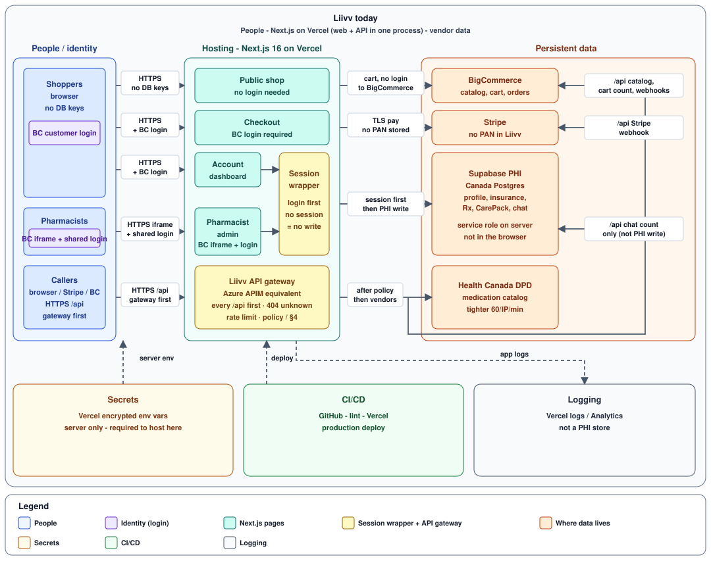
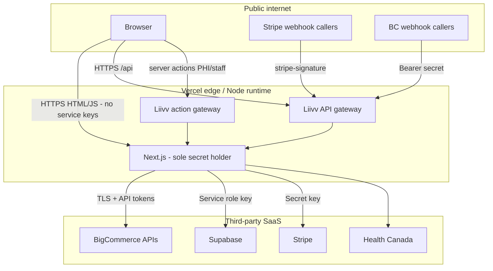
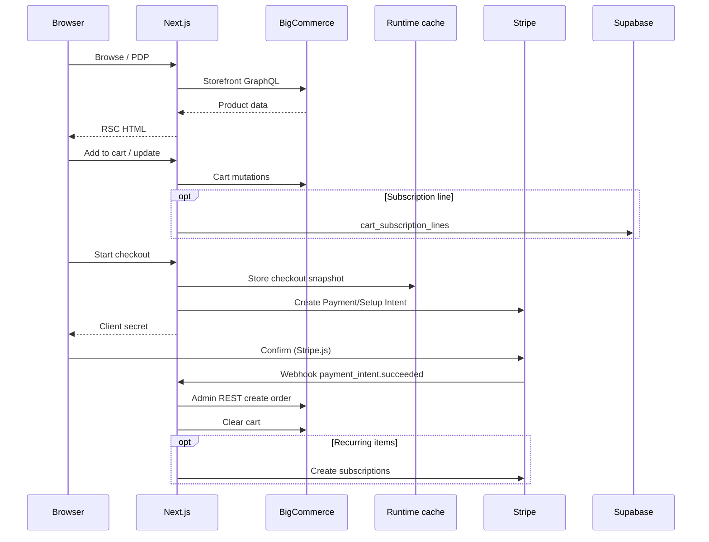
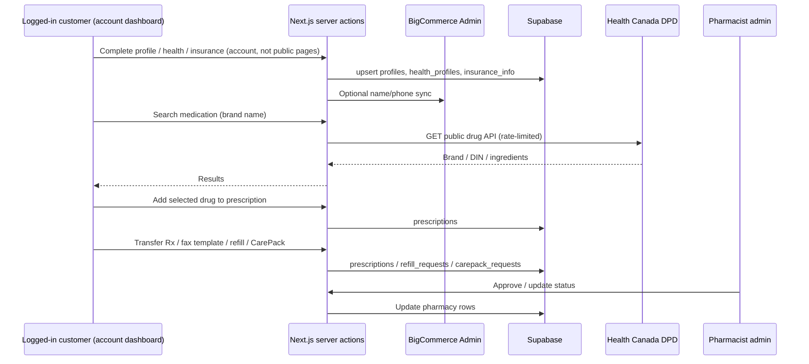
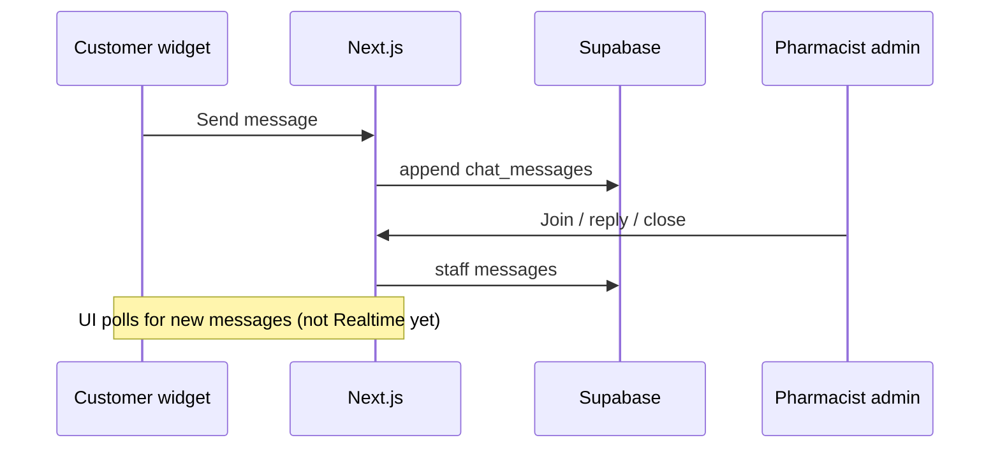

# Liivv — Architecture

**For:** IT / security review of the **application** (current stack)  
**From:** Liivv — the people who built the app and who administer the BigCommerce store  
**App:** Next.js 16 storefront (`core/`) + Liivv health and pharmacy extensions  
**Date:** September 2026  
**Status:** Current — Vercel + BigCommerce + Canadian Supabase + Stripe  

**PDF:** [Liivv-Architecture.pdf](./Liivv-Architecture.pdf)

This pack is **us talking to IT**. It describes **today’s** app on **Vercel**. We do not claim Azure products we are not running. Where an Azure product has an equivalent in this app (API gateway layer, encrypted secrets, pharmacist login), that is what we show.

Gaps are labeled **We** (we change the app or a vendor setting) or **IT** (tell us if this is a requirement). There is no separate engineering / ops / legal team in this conversation.

**Contents**

The security story is **§2 → §3 → §4** (map, still missing, already defended). **§1** is the ask. **§5–§14** is how the app works.

| § | Section | Job |
| --- | --- | --- |
| 1 | [What we are asking you to review](#1-what-we-are-asking-you-to-review) | Why IT is scoring this app (leak, fake payment, key in the page) |
| 2 | [Layers → Liivv today](#2-layers-liivv-today) | **Map** — what pieces exist |
| 3 | [Open gaps](#3-open-gaps) | What is **still missing** (**G1**, **G5**) |
| 4 | [Controls S1–S9](#4-controls-s1-s9) | What is **already defended**, including vendor down |
| 5 | [Systems of record](#5-systems-of-record) | Who owns shop vs health vs cards |
| 6 | [Trust boundary](#6-trust-boundary) | Who is untrusted; `/api` gateway + action gateway |
| 7 | [How the app talks to the database](#7-how-the-app-talks-to-the-database) | Browser never opens Supabase; service role + RLS |
| 8 | [Identity and pharmacist admin](#8-identity-and-pharmacist-admin) | Shopper login vs pharmacist admin |
| 9 | [Health Canada DPD](#9-health-canada-dpd) | Public drug catalog proxy — not PHI |
| 10 | [Other systems (short)](#10-other-systems-short) | Store engine; AI assistant is off |
| 11 | [System context](#11-system-context) | Picture of callers and vendors |
| 12 | [Data flows](#12-data-flows) | Sequences: checkout, renewals, chat |
| 13 | [Auth cookies and secrets](#13-auth-cookies-and-secrets) | Cookies, webhook secrets, env vars |
| 14 | [Evidence paths (code)](#14-evidence-paths-code) | File paths if they want to look at the repo |

---

## 1. What we are asking you to review

Liivv is a **Next.js 16** app (App Router) on **Vercel**. Shoppers see one site. The **browser is not the database client**. Next.js is the only process that holds service-role, admin, and payment secrets.

You are scoring whether **this application** would be a leak or jump-off point: can a shopper or random caller read PHI, fake a payment, or walk into a database with a key from the page?

IT often scores an Azure web app → API gateway → microservices → SQL **in the same estate**. Liivv is one Node runtime that calls **vendors** (BigCommerce, Supabase, Stripe) over TLS. Same *idea*: only the server talks to the database. Different *platform*. The **block diagram** is in **§2**.

**Residual (true of that Azure pattern too):** if someone steals the **server** secret (Supabase service role, BC admin token, Stripe secret), row rules on the database do not stop them. Mitigation is secret hygiene and never putting those keys in the browser — not “the database cannot be hacked.”

---

## 2. Layers → Liivv today

**Map only.** What the system is made of. What is still missing and what is already defended are **§3** and **§4**.

IT’s usual picture is **layers**: people → web app → gateway → services → SQL, plus identity, vault, CI/CD, and logging. Liivv uses the **same layers**. The picture below is that drawn for **this** app.



One picture, **five lanes**. The `/api` gateway arrows go to the **same vendor boxes** as shopping and health (they may cross). Identity (purple chips) is **BigCommerce** for shoppers and a **shared pharmacist login** for the Rx/chat admin. Both yellow boxes sit **inside** Hosting — they are Next.js code, the APIM-shaped layer in this app. Secrets are **Vercel encrypted env vars** (that is how this host injects keys; Azure Key Vault is not a Vercel setting).

| Lane | What it says |
| --- | --- |
| **Public shop → BigCommerce** | **No login needed.** Cart is saved in **BigCommerce**. Cookie = cart id only. |
| **Checkout → Stripe** | **BC login required**, then **Stripe** (no PAN). Renewals: Stripe bills → BC order. |
| **Account → action gateway → Supabase PHI** | Health, insurance, Rx, chat. Page points **in** to the yellow action gateway (`runCustomerAction`); gateway points **out** to PHI. No session, no write. Not `/api`. |
| **Pharmacist admin → action gateway → Supabase PHI** | Approve prescriptions and answer care chat. Lives in a **BigCommerce admin iframe** (`/pharmacy-admin`). After BC opens the app, **additional** shared username/password at `/pharmacy-admin/login`. |
| **Callers → Liivv API gateway** | **Azure APIM equivalent.** Every `/api` hit first. Unknown = 404. **One** line then splits: Health Canada **DPD**, and around to **BigCommerce**, **Stripe**, and **Supabase** (chat count only). Gateway policies in **§6**. |

**How to read the layers:** A typical Azure app splits **web app**, **API gateway**, and **backend services**. Liivv is **one** Next.js process. The **yellow** boxes are our two doors (**action gateway** for PHI form posts, **API gateway** for `/api`). Shop and checkout **skip** the action gateway. SQL sits at **vendors**, not next to the app.

| Layer | Liivv today |
| --- | --- |
| Web app | Next.js 16 on **Vercel** (HTML, account dashboard, pharmacist admin) |
| API gateway | **Liivv API gateway** — **Azure APIM equivalent**. Every `/api/*` hits it first. Unknown = 404. Rate limit + per-route policy. PHI form posts use the **action gateway**, not `/api`. |
| Form posts (server actions) | **Liivv action gateway** (`core/lib/action-gateway/`): PHI / staff / account-kit writes run `runCustomerAction` or `runStaffAction` first. Guest cart is **not** in this wrapper. |
| Backend microservices | **One** Node runtime, not a mesh of services |
| SQL in the estate | **Canadian Supabase Postgres** (PHI). Shop data in **BigCommerce**. Not Azure SQL next to the app |
| Identity / SSO / MFA | Shoppers: **BigCommerce** login. Pharmacists: BC control-panel iframe + **shared Liivv login** (password in Vercel encrypted env). Entra: see **§3 G1** |
| Secrets / vault | **Vercel encrypted env vars** (required to host). Azure Key Vault is not how Vercel injects secrets |
| Rate limiting | Every `/api`: 120 / IP / min, one shared counter. DPD also 60 / IP / min |
| Webhook auth | Stripe signature; BC Bearer secret |
| CI/CD | GitHub → **Vercel production**. Preview is local (Cursor / `.env.local`), not Vercel Preview |
| Veracode, Sonar, CrowdStrike | **Not in this pipeline** — see **§3 G5** |
| Logging | Vercel logs + Analytics + Speed Insights. No care-chat bodies in logs — see **§4** |
| Backup / RPO | Supabase daily backups + restore — see **§4** |
| Vendor down | Degraded UI per system (notice, not 500), not failover — see **§4** |
| Email | **BigCommerce** transactional mail |

---

## 3. Open gaps

**Still missing.** Everything already defended is in **§4** next.

| ID | Gap | Today | We / IT |
| --- | --- | --- | --- |
| G1 | **Entra SSO / MFA on Liivv** | Shopper login is BigCommerce. Pharmacist admin is BC iframe + one shared login (password in Vercel encrypted env). | **IT:** Entra needs your approval. We cannot turn it on ourselves. |
| G5 | **Veracode / Sonar / CrowdStrike** | Not in this repo’s pipeline | **IT:** say if these scanners are required. Not in our pipeline today. |

---

## 4. Controls S1–S9

**Already defended.**

| ID | Topic | If left unchecked | Status | Control |
| --- | --- | --- | --- | --- |
| **S1** | Who can query Supabase | High | **In place** | No DB key in the browser. RLS deny-by-default; **no** anon/authenticated policies. Service role only on the Next.js server. App uses **HTTPS** (PostgREST) — see notes below. |
| **S2** | Where health data lives | High | **In place** | PHI in **Canadian** Supabase. Transfer or fax only. Vendor DPAs/BAAs in place. Daily backups + restore steps below. |
| **S3** | Pharmacist access | Med | **In place** | BC iframe load session + shared username/password at `/pharmacy-admin/login`. Password in Vercel encrypted env. Rate-limited. Entra is still open (**§3 G1**). |
| **S4** | AI chat assistant | Med | **Off** | `VIRTUAL_CARE_BOT_ENABLED=false`. Remains off. We can use IT resources later if we decide to implement it. |
| **S5** | Environment secrets | Med | **In place** | Vercel encrypted env + gitignored `.env.local`. Only production keys on Vercel; no Vercel Preview (local preview is Cursor). |
| **S6** | Pharmacist admin framing | Med | **In place** | Inside BigCommerce admin **iframe** (`/pharmacy-admin`). Cookies `SameSite=None` for the embed. Extra shared login after BC opens the app. |
| **S7** | Customer email | Low | **In place** | BigCommerce transactional mail. |
| **S8** | Medication search (DPD) | Low | **In place** | Gateway policy **dpd-public** + server proxy. All `/api` 120/IP/min; DPD also 60/IP/min; one shared counter. |
| **S9** | API gateway | Med | **In place** | Liivv API gateway on every `/api/*` (deny unknown; rate limit; per-route policy) plus **action gateway** on PHI / staff form posts. |

**Also in place:** Stripe and BigCommerce webhooks verified; cart ID in a signed JWT; care-chat **message bodies are not** written to Vercel logs (`core/lib/chat/logging-policy.ts`).

### S1 notes — Supabase network path

`core/lib/supabase/client.ts` uses **`supabase-js` over HTTPS** (PostgREST). There is **no** direct Postgres connection string in the app.

Supabase “Network Restrictions” cover only **Postgres and the pooler** — **not** HTTPS APIs. Locking Postgres to Vercel egress IPs would **not** gate the path this app uses. The real path is protected by: no browser key, RLS deny-by-default, and service role only on the server.

**Optional** (Postgres/pooler only, if IT still wants it): enable **Vercel Static IPs**, then allow those CIDRs under Supabase → Database → Network Restrictions. Without static egress, Vercel outbound IPs change and an allowlist will break production. Local Cursor/SQL tools would need their own allowlisted egress too.

### S2 notes — Backup / RPO (restore after data loss)

**Not the same as** “vendor down” (degraded UI below). This is **restore after data loss**.

| Mode | What it is | Typical RPO |
| --- | --- | --- |
| Daily backups | Automatic on Pro / Team / Enterprise; retention depends on plan | Up to ~24 hours of loss |
| Point-in-Time Recovery (PITR) | Paid add-on | Worst case ~2 minutes (per Supabase docs) |

**Liivv target:** accept daily-backup RPO (~24h) unless PITR is enabled. **Owner:** Liivv app admins (Supabase project access), not IT Azure ops.

**Restore (daily backup):** Supabase Dashboard → Database → Backups → pick timestamp → restore → verify shopper health/Rx/chat and `/pharmacy-admin` → note restore time for IT if reportable. PITR optional under project add-ons. BigCommerce / Stripe recovery is those vendors’ own backups.

### Care-chat logging

Do **not** write care-chat message bodies, appointment free-text, or voice transcripts to stdout / Vercel logs. Enforcement: `logChatOperationalError` in `core/lib/chat/logging-policy.ts`. Messages live in Canadian Supabase; staff read them in `/pharmacy-admin`.

### Vendor down (availability — not backup)

If a **vendor** is unreachable, the app does **not** fail over to a second copy. There is no replica shop, no second Stripe, no second BigCommerce. The Next.js app **degrades**: remaining vendors still work; the shopper sees a **plain-language notice** instead of a generic 500.

**What we implemented (storefront):** catch a vendor that is unreachable (network / 502–504), and return a notice. Env vars missing (“not configured”) is a different case from “configured but down.”

| Down | Shop / cart | Checkout pay | Account health / pharmacist |
| --- | --- | --- | --- |
| **BigCommerce** | Friendly “store unavailable” (catalog, cart, and checkout all need BC) | No | Login / account chrome needs BC |
| **Supabase** | Yes (subscribe + curated kit add UI hidden; existing sub cart lines cannot check out) | One-time pay still works; **subscriptions** and **cart kits** disabled site-wide | Health profile, pharmacy, care chat, pharmacist queues: unavailable — not a 500; Account → Subscriptions shows unavailable |
| **Stripe** | Yes (subscribe UI hidden) | Payment section: “payments unavailable”; **cart is kept**; **subscriptions disabled** | Health ok; subscription list unavailable |
| **Vercel** | Whole site down | | |

**Where in the app:** `core/lib/vendor-outage/` (detect + copy). BigCommerce GraphQL failures wrap to that error. Supabase HTTPS failures degrade health/pharmacy/chat. Checkout probes Stripe and disables pay if Stripe does not answer (`core/lib/stripe/availability.ts`). **Subscriptions** require Stripe reachable and (when configured) Supabase reachable (`core/lib/subscriptions/availability.ts`) — PDP / product cards hide Subscribe, add-to-cart refuses subscription, Account → Subscriptions and checkout with subscription lines degrade. **Cart kits** require Supabase reachable when configured (`core/lib/kit/availability.ts`) — curated kit PDP and add-kit-to-cart are disabled (`cart_kit_sessions`).

**What the app does when each system is down**

This is **not** G9 (restore after data loss). Shopper copy is the notice above. Background behavior is separate — especially **renewals**, which do **not** go through the checkout page.

**If BigCommerce is down**

- **This website:** catalog, cart, checkout, and account login cannot load. Shopper sees “The store is temporarily unavailable.”
- **Renewals:** Stripe still owns the card and still charges the due cycle. They POST `invoice.paid` to `/api/stripe/webhook`. We try to create the BigCommerce shop order. If BC is still down, we return **5xx** so Stripe retries for about **three days**. A retry of the same invoice does **not** skip just because we already queued it — we try the shop order again. We ack 200 only when the BC order already exists, or the rest of that day’s shipment batch is still unpaid. There is **no** extra sweeper. **Account → Subscriptions** can also retry a due batch. After Stripe stops retrying, a Dashboard resend of `invoice.paid` is the manual path.

**If Stripe is down**

- **This website:** browse and cart still work. **Subscribe is hidden** site-wide (PDP, product cards, account subscriptions, care bot). Checkout cannot take a **new** payment. Shopper sees “Payments are temporarily unavailable”; **the cart is kept**. Account health still loads.
- **Renewals:** Stripe Billing still owns the card on file. If Stripe’s billing was down and then returns, they still generate that cycle’s invoice and charge. Then they POST `invoice.paid` and we create the BC order. Storefront “payments unavailable” only means **this website** cannot start a **new** checkout with Stripe.

**If Supabase is down**

- **This website:** shop, cart, and **one-time** checkout still work. **Subscriptions are disabled** site-wide (same as Stripe down for subscribe UI / new sub checkout / Account → Subscriptions). **Curated cart kits are disabled** (PDP customizer + add kit to cart — `cart_kit_sessions`). Health profile, pharmacy, care chat, and pharmacist queues show “Health tools are temporarily unavailable” — not a 500.
- **Renewals:** Stripe still charges. The shop order is still created in BigCommerce. If shipment-batch records cannot be written (they live in Supabase when it is configured), the webhook returns 5xx and Stripe retries the same way as BC-down, for about three days.

**If Vercel is down**

- **This website:** the whole app is unreachable (shop, account, pharmacist, `/api`).
- **Renewals:** Stripe still charges on their side. `invoice.paid` cannot reach us until Vercel is back; Stripe retries that webhook for about three days. Same retry/idempotent shop-order rules as above once we are up.

**Not claimed:** multi-region failover, a second vendor, or “the whole site stays up no matter which vendor is down.”

---

## 5. Systems of record

Shoppers see one site. **Commerce and health data use different systems of record.**

- **BigCommerce** — catalog, cart, checkout, orders, customer login, most customer email.
- **Supabase** — Canadian Postgres (`ca-central-1`): profile, insurance, prescriptions, CarePack, care chat.
- **Stripe** — card charges and subscriptions. PAN / CVC **never** stored in Liivv.

Orders are not stored in Supabase. Health records are not stored in BigCommerce.


| Function | System | Boundary |
| --- | --- | --- |
| Catalog, cart, checkout, order of record | BigCommerce | Shop engine — not health records |
| Health profile, insurance, prescriptions, care chat | Supabase | Canadian Postgres — not the shop |
| Card charges and subscriptions | Stripe | Payment processor — PAN / CVC never stored |

| Domain | System of record | Notes |
| --- | --- | --- |
| Storefront hosting | Vercel | Next.js 16 — not a data store of record |
| Products, categories, prices | BigCommerce | Synced to Stripe prices via BC webhooks |
| Customers (login identity) | BigCommerce | Linked in Supabase `profiles.bigcommerce_customer_id` |
| Cart / checkout cart | BigCommerce GraphQL | Cart ID in signed Auth.js / anonymous JWT |
| Orders | BigCommerce | Admin REST after Stripe success |
| Payment methods & subscriptions | Stripe | Renewals charge at Stripe; Liivv creates the BC order on `invoice.paid` (see **§4** — Stripe retries the shop order if BC or the webhook was down) |
| Health profile, insurance, Rx, CarePack, chat | Supabase | Not modeled in BC; pharmacist queue in `/pharmacy-admin` (BC admin iframe) |

**PII** (personally identifiable information) is who they are: name, email, address, BC customer id — BigCommerce + Supabase `profiles`.  
**PHI** is who they are **plus** health: insurance, Rx, CarePack, chat — Supabase only.

Canadian privacy frame is **PIPEDA** (and **PHIPA** in Ontario). HIPAA is a US statute; we do not claim HIPAA because we listed a Canadian region.

---

## 6. Trust boundary

The browser never receives service keys. Next.js on Vercel is the only secret holder.



Vercel is **hosting**, not a system of record. Secrets live in the Vercel project (encrypted) and gitignored `.env.local`.

There are **two** app-layer front doors (both **in place**, closed **G4**):

1. **Liivv API gateway** — every `/api/*` request (proxy).
2. **Liivv action gateway** — PHI / staff / account-kit **server actions** (form posts). They never hit the `/api` gateway.

### Liivv API gateway

**App-layer API gateway (Azure APIM equivalent).** The Liivv API gateway in the Next.js proxy (`core/proxy.ts` → `core/lib/api-gateway/`) is that layer **in this app**. **Every** `/api/*` request hits it **before** the route. Unknown paths are **denied**. Allowlisted paths are **rate-limited** (120 / IP / min, shared counter), then get a policy:

| Policy | Paths | What the gateway checks |
| --- | --- | --- |
| **customer-session** | `/api/account/*`, `/api/live-chat/*` | Logged-in BigCommerce customer (session). No session → 401. Plus the all-`/api` rate limit (120 / IP / min). |
| **webhook-stripe** | `POST /api/stripe/webhook` | `stripe-signature` header present. Route still verifies the signature. Plus the all-`/api` rate limit (120 / IP / min). |
| **webhook-bigcommerce** | `POST /api/bigcommerce/webhook` | `Authorization: Bearer` matches the webhook secret. Plus the all-`/api` rate limit (120 / IP / min). |
| **dpd-public** | `/api/medications/*` | All-`/api` rate limit (120 / IP / min), then a tighter 60 / IP / min. Catalog only — no PHI. |
| **bc-app-handshake** | `/api/bigcommerce/app/*` | Allowlisted. Signed load token is verified in the route. Plus the all-`/api` rate limit (120 / IP / min). |
| **auth-public** | `/api/auth/*` | Login endpoints. Must stay reachable or nobody can sign in. Plus the all-`/api` rate limit (120 / IP / min). |
| **storefront-public** | `/api/products/*`, `/api/categories/*`, `/api/cart/*`, `/api/customer/*`, `/api/archive/*` | Public shop data. Server holds BC tokens. Plus the all-`/api` rate limit (120 / IP / min). |
| *(none — denied)* | Any other `/api/...` | **404.** Not on the allowlist. |

**Each `/api` route and its policy**

| Route | Policy |
| --- | --- |
| `POST /api/stripe/webhook` | webhook-stripe |
| `POST /api/bigcommerce/webhook` | webhook-bigcommerce |
| `GET /api/bigcommerce/app/auth` | bc-app-handshake |
| `GET /api/bigcommerce/app/load` | bc-app-handshake |
| `GET /api/bigcommerce/app/uninstall` | bc-app-handshake |
| `GET /api/medications/search` | dpd-public |
| `GET /api/medications/[drugCode]/details` | dpd-public |
| `GET /api/live-chat/unread-count` | customer-session |
| `POST /api/account/notifications/mark-read` | customer-session |
| `/api/auth/*` (NextAuth login) | auth-public |
| `GET /api/products/[entityId]` | storefront-public |
| `GET /api/products/ids` | storefront-public |
| `GET /api/products/group/[group]` | storefront-public |
| `GET /api/categories/search` | storefront-public |
| `GET /api/categories/by-ids` | storefront-public |
| `GET /api/categories/products` | storefront-public |
| `GET /api/cart/line-item-count` | storefront-public |
| `GET /api/customer/group` | storefront-public |
| `GET /api/customer/groups` | storefront-public |
| `GET /api/archive/diabetes-care/[section]` | storefront-public |

### Liivv action gateway

**Second front door — not `/api`.** Health and pharmacy **writes** are Next.js **server actions** (form posts) on `/account/...`, `/liivv-health`, and `/pharmacy-admin`. They **never** go through `core/proxy.ts` or the API gateway. Instead each sensitive action calls **`runCustomerAction`** or **`runStaffAction`** first (`core/lib/action-gateway/session.ts`). No session → no service-role write.

This is **session enforcement**, not rate limiting. Rate limits live on the API gateway. The action gateway answers: “Is this caller a signed-in shopper or staff before we touch Supabase PHI?”

| Wrapper | Who | What the gateway checks | If there is no session |
| --- | --- | --- | --- |
| **`runCustomerAction`** | Shopper PHI and account kits | Auth.js / BigCommerce customer via `getOnboardingCustomer()` | Return an error result, or **redirect** to login |
| **`runStaffAction`** | `/pharmacy-admin` queue and chat | BC iframe session **and** shared pharmacist session (`hasStaffAccess()`) | `{ ok: false, error: 'Unauthorized.' }` |

`withAuth` still redirects **GET** `/account/...` to login (page load). The action gateway is what stops a **POST** (the actual write) if the session is missing or forged.

**Each wrapped server action**

| Action (module) | Wrapper | Data touched |
| --- | --- | --- |
| `saveHealthProfileStep` | `runCustomerAction` | Health profile (PHI) |
| `saveInsuranceStep` | `runCustomerAction` | Insurance (PHI) |
| `pharmacyAction` | `runCustomerAction` | Prescriptions / transfers (PHI) |
| `virtualCareChatAction`, `virtualCareAppointmentAction`, chat voice / unread helpers | `runCustomerAction` | Care chat + appointments (PHI) |
| `renameSavedKitAction`, `deleteSavedKitAction`, `addSavedKitToCartAction` | `runCustomerAction` | Saved kits (account) |
| `saveSignedInLandingQuiz`, `applyPendingGuestHealthProfile` | `runCustomerAction` | Onboarding answers → profile |
| `staffPortalAction`, `loadOlderStaffChatMessagesAction` | `runStaffAction` | Pharmacist queue + staff chat |

**Not in this wrapper (by design)**

| Kind | Examples | Why |
| --- | --- | --- |
| Guest / shop commerce | Cart line updates, product wishlist, guest stash of quiz answers before login | Commerce or pre-auth; not a PHI write under the service role for a known customer |
| Checkout / Stripe | `initializePayment`, subscription portal actions | Payment path; session/cart checks live in those modules, not the PHI action gateway |
| Public contact / auth forms | Contact form, register, change password | Not Supabase PHI via service role |

Guest cart / product buttons are **not** wrapped — those are commerce, not PHI.

Azure APIM as a named Azure SKU would need Azure hosting; we are on Vercel. The two gateways above are the APIM-shaped layer **in this app** (**in place**).

---

## 7. How the app talks to the database

The browser **never** opens Supabase.

1. Customer or pharmacist hits Next.js (public shop, **`/account/...` dashboard**, or `/pharmacy-admin` inside BC admin).
2. Next.js checks the session through the **Liivv action gateway** (`runCustomerAction` / `runStaffAction`) — Auth.js / BigCommerce customer, or **BC iframe session + shared pharmacist session**.
3. **Only then** the server uses `SUPABASE_URL` + **service role** ([`core/lib/supabase/client.ts`](../core/lib/supabase/client.ts) is `server-only`).
4. Table access is server modules (profiles, health, insurance, prescriptions, chat) — not a connection string in JavaScript shipped to the shopper.

**Row Level Security (RLS)** is **on**, with **no** anon/authenticated policies (deny by default). That stops a stolen **browser/anon** path from reading tables. The **service role bypasses RLS** — same class of risk as any API using a privileged SQL login. RLS is not “Supabase cannot be hacked.”

PHI forms are **not** on the homepage. Profile, health, insurance, pharmacy, and care chat are in the **logged-in account dashboard**. Those writes go through the action gateway before the service role.

---

## 8. Identity and pharmacist admin

| Who | How they get in | What they see |
| --- | --- | --- |
| Customer | BigCommerce login (Auth.js session) | Public shop; after login, account dashboard |
| Anonymous shopper | Signed cart cookie | Catalog and cart only |
| Pharmacist | **BC admin iframe** (`/pharmacy-admin` load) **+** shared username/password at `/pharmacy-admin/login` | Approve prescriptions, customers, care chat |

**Pharmacist admin** lives **inside the BigCommerce control panel** as an iframe app (`/pharmacy-admin`). Opening it verifies BC’s signed load token and sets `liivv_pharmacy_admin`. Then pharmacists enter **one** shared username and password (`PHARMACIST_USERNAME` / `PHARMACIST_PASSWORD`) for `liivv_pharmacist`. **Both** are required for staff actions. `/admin` only redirects to the BigCommerce control panel.

Pharmacists read and update **Supabase** (prescription / refill / CarePack queues, customer pharmacy detail, care chat) — not BigCommerce orders.

**Entra SSO is not wired.** We cannot connect it unless **IT approves and provides an Entra connection**. Until then, **BC iframe + one shared pharmacist login** is the control. The username and password live in **Vercel encrypted env vars** (same as other server secrets). We cannot tell which person approved an Rx. Shopper MFA is also not in place.

---

## 9. Health Canada DPD

The **Drug Product Database** is Health Canada’s **free public API** (open government data — no key, no paid contract). Customers search by brand when adding a prescription in the account dashboard. Next.js **proxies** the call (browser never talks to Health Canada). The **prescription is stored in Supabase**. DPD is a catalog only.

Rate limit: **every** `/api` call is 120 / IP / min at the gateway; DPD search is also **60 / IP / min**. Counts are stored in **Vercel Runtime Cache**, so every instance shares the same counter.

---

## 10. Other systems (short)

**BigCommerce** is the only store engine: catalog, cart, checkout, official order, customer login, most email. Recurring: Stripe bills; Liivv still creates the order in BigCommerce.

**AI chat assistant** (Olivia) is **off** (`VIRTUAL_CARE_BOT_ENABLED`). Human care chat stays in Supabase via `/pharmacy-admin`. It **remains off** in production; we can use IT resources later if we decide to implement it.

---

## 11. System context


---

## 12. Data flows

### Commerce



### Account dashboard — onboarding and pharmacy



### Care chat



---

## 13. Auth cookies and secrets

| Plane | Mechanism | Cookie | Secret | Path / lifetime |
| --- | --- | --- | --- | --- |
| Customer | NextAuth → BC GraphQL login or Customer Login JWT | Auth.js session JWT | `AUTH_SECRET` | Site-wide |
| Anonymous cart | Signed JWT containing `cartId` | `authjs.anonymous-session-token` | `AUTH_SECRET` | 7 days |
| Pharmacist (BC load) | Signed load JWT verified | `liivv_pharmacy_admin` | `BIGCOMMERCE_APP_CLIENT_SECRET` | `/pharmacy-admin`, 12 hours, `SameSite=None` |
| Pharmacist (shared login) | Shared username + password | `liivv_pharmacist` | `AUTH_SECRET` (signs cookie); `PHARMACIST_USERNAME` / `PHARMACIST_PASSWORD` | `/pharmacy-admin`, 12 hours, `SameSite=None` |

**Webhooks:** Stripe `constructEvent` + `STRIPE_WEBHOOK_SECRET`. BigCommerce `Authorization: Bearer` + `BIGCOMMERCE_WEBHOOK_SECRET`.

| Secret | Purpose |
| --- | --- |
| `AUTH_SECRET` | Auth.js + anonymous cart JWT + pharmacist session cookie |
| `PHARMACIST_USERNAME` / `PHARMACIST_PASSWORD` | Shared pharmacist admin login |
| `BIGCOMMERCE_STOREFRONT_TOKEN` | Storefront GraphQL |
| `BIGCOMMERCE_ACCESS_TOKEN` | Admin REST (orders, customers) |
| `BIGCOMMERCE_CLIENT_ID` / `CLIENT_SECRET` | Customer Login API JWT |
| `BIGCOMMERCE_WEBHOOK_SECRET` | Product → Stripe sync |
| `BIGCOMMERCE_APP_CLIENT_ID` / `SECRET` | Embedded staff app |
| `STRIPE_SECRET_KEY` / `STRIPE_WEBHOOK_SECRET` | Payments |
| `NEXT_PUBLIC_STRIPE_PUBLISHABLE_KEY` | **Public** — Stripe.js only |
| `SUPABASE_URL` / `SUPABASE_SERVICE_ROLE_KEY` | DB (bypasses RLS) |

---

## 14. Evidence paths (code)

```
core/proxy.ts
core/lib/api-gateway/
core/lib/action-gateway/
core/lib/kv/
core/package.json
.env.example
core/auth/index.ts
core/lib/supabase/client.ts
core/lib/supabase/onboarding-schema.sql
core/lib/supabase/pharmacy-schema.sql
core/lib/bc-app-session.ts
core/lib/pharmacist-session.ts
core/lib/staff-access.ts
core/lib/chat/logging-policy.ts
core/lib/vendor-outage/
core/lib/stripe/availability.ts
core/lib/content-security-policy.ts
core/lib/pharmacy/medication-rate-limit.ts
core/lib/stripe/webhook-handlers.ts
core/lib/virtual-care-bot/
core/app/api/medications/
core/app/api/stripe/webhook/route.ts
core/app/api/bigcommerce/webhook/route.ts
core/app/api/bigcommerce/app/{auth,load,uninstall}/route.ts
core/app/pharmacy-admin/
```
