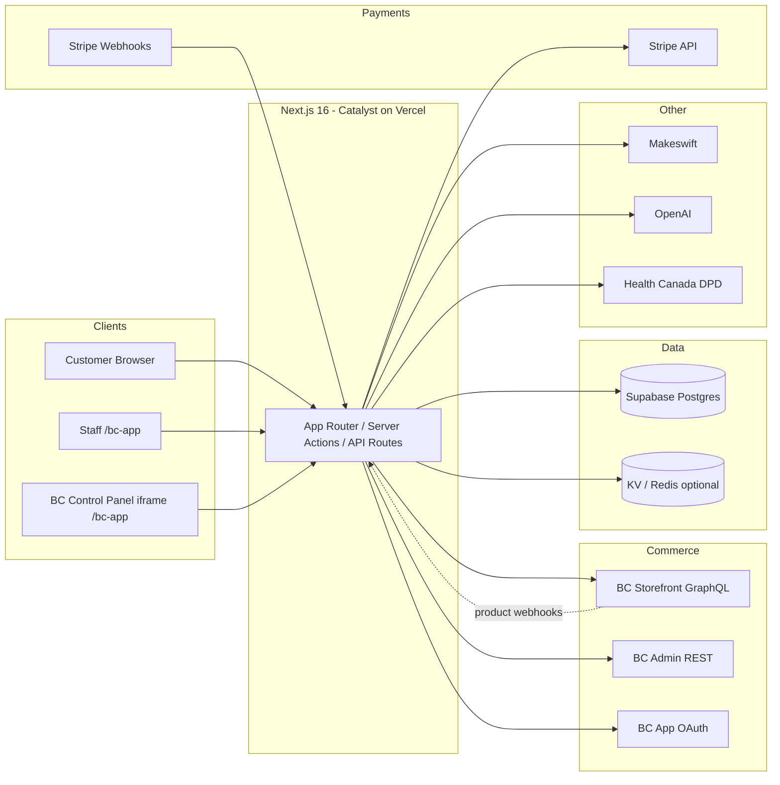
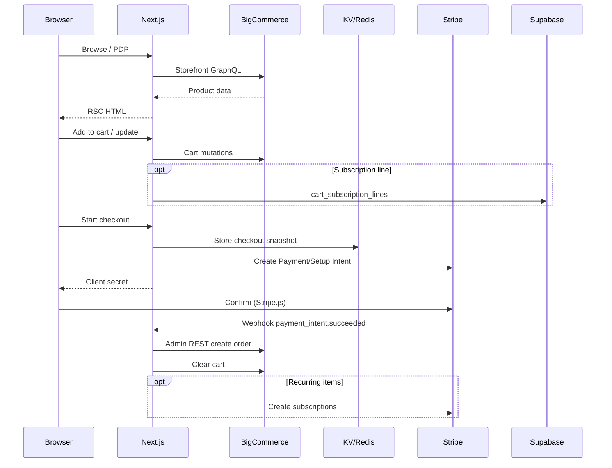
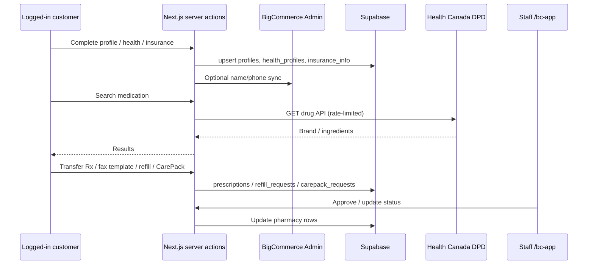
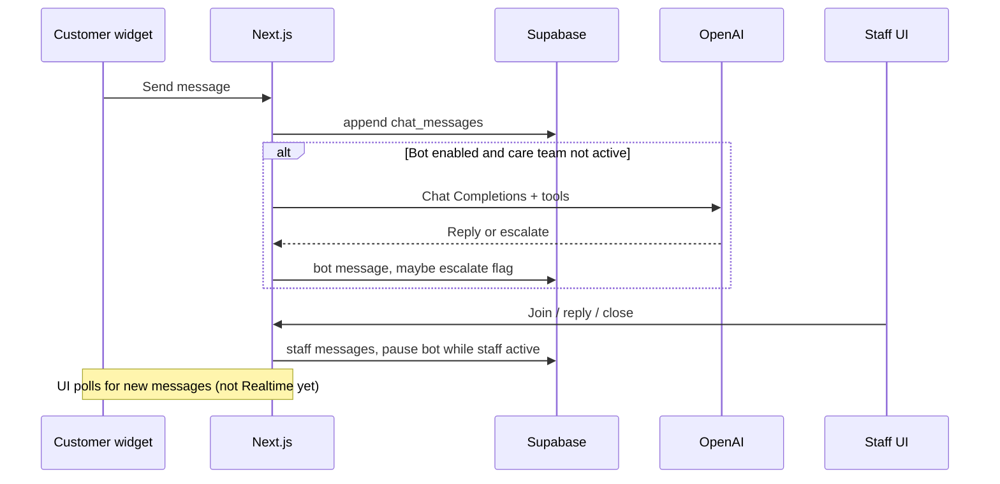
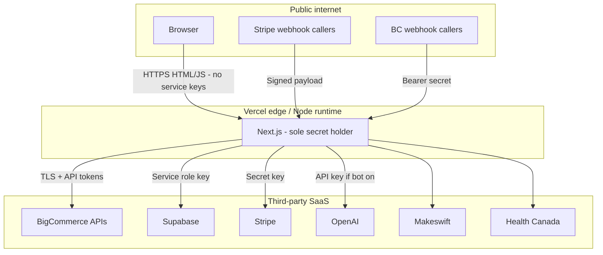

# Liivv — How it works and IT architecture

**Audience:** Managers and IT (security / infrastructure review)  
**App:** BigCommerce Catalyst storefront (`core/`) + Liivv health and pharmacy extensions  
**Date:** August 2026  
**Status:** Single source of truth (replaces the former How-Liivv-Works and IT-Architecture packs)  
**PDF:** [Liivv-Architecture.pdf](./Liivv-Architecture.pdf) (same content, for email / print)

How to use this file:

- **Managers:** read **§1–§3**. That is the story of why shopping and health data are split.
- **IT:** read the whole document. **§9** is the pre-launch security checklist (S1–S8).

---

## 1. The one-sentence version

Liivv is a health storefront with **two separate engines**:

- **BigCommerce** runs the shop (the same kind of product as Shopify).
- **Supabase** holds health records in a **Canadian** Postgres project.

Orders never live in the health locker. Health records never live in the shop. The customer only sees Liivv. Behind the website, shopping and health information take different doors on purpose.


| Job | Who does it | Simple analogy |
| --- | --- | --- |
| Show products, take the cart, create the order | BigCommerce | The shop floor and the till |
| Remember health needs, insurance, prescriptions, care chat | Supabase | A locked filing cabinet in Canada |
| Charge the card, including repeating subscriptions | Stripe | The bank — we never see the card number |

A store is built to sell products. A clinic-style locker is built to keep sensitive health information. Using one system for both would be like keeping medical files in a cash register.

**Design principle (technical):** browsers never receive service-role, admin, or payment secrets. **Next.js on Vercel is the trust boundary.**

---

## 2. What each system is for

### BigCommerce is the only store engine

Liivv does not invent a second checkout. We do not process orders ourselves.

**What BigCommerce handles**

- Product catalog, prices, and categories
- Cart and checkout path
- Customer accounts used to sign in
- The official order after payment succeeds
- Most **customer email** (password reset, order mail) — branding and DNS live in the BC control panel

**What it is not used for**

- Health questionnaires or care needs
- Insurance details
- Prescriptions, refills, or CarePack requests
- Conversations with the care team

**Recurring orders:** Stripe handles the repeating charge. When a renewal succeeds, Liivv still creates the order in BigCommerce. Stripe is the billing engine. BigCommerce remains the only order engine.

### What Supabase is

A professionally run Postgres database (plus optional Storage). In plain language: a secure place where Liivv keeps records a shop is not meant to hold.

- **A filing cabinet.** Health profile, insurance, prescriptions, refill/CarePack requests, care chat.
- **Not a second store.** It does not take payments or create orders.
- The customer never talks to Supabase directly. Liivv’s server holds the service-role key.

This project’s Supabase region is **Canada (Central) / `ca-central-1`**.

**Patients do not upload prescription photos.** Adding a prescription is **transfer from another pharmacy** or **doctor fax**. Staff work the queue in the BigCommerce embedded app (`/bc-app`).

### Stripe, Makeswift, OpenAI, Health Canada

| Layer | Technology | Role |
| --- | --- | --- |
| Storefront | **Next.js 16** (App Router) on **Vercel** | Only app that holds secrets; UI; server actions; webhooks |
| CMS | **Makeswift** | Marketing / content pages |
| AI assistant | **OpenAI** (optional, feature-flagged) | Store assistant in account chat — **off** until Legal decides on a DPA |
| Drug reference | **Health Canada DPD** | Medication search (server proxy, rate-limited) |
| Ephemeral cache | **Upstash Redis** (optional) or Vercel runtime cache | Checkout snapshots, BC app install token, stronger rate limits |

Upstash Redis is **not required** for launch if Supabase is configured. It is cheap insurance for checkout/webhooks, the staff-app install token, and site-wide medication rate limits.

### Chat assistant

Care conversations live in Supabase. An on-site assistant (Olivia) can help with products, orders, and account how-tos **when we turn it on**. It is not a clinician.

If `VIRTUAL_CARE_BOT_ENABLED=true` and an API key is set, **customer message text is sent to OpenAI** even when the bot refuses clinical advice and points people to a pharmacist. That flag stays **false** until the team decides whether to buy an OpenAI arrangement that includes a **DPA** (Data Processing Agreement — a contract that says OpenAI may process this data for us and how they must protect it).

Human care-team chat in `/bc-app` still stays in Supabase either way.

---

## 3. PHI and the “medical server” idea

**PHI** means protected health information — anything that could identify a person and say something about their health.

A stronger production posture is a **paid Canadian Supabase project** with healthcare-oriented extras (contract, backups, network locks). HIPAA is a **US** law; Canada’s conversation is **PIPEDA** (and **PHIPA** in Ontario). Supabase’s healthcare add-on is still the practical “vault grade” package they sell — not a claim that US law is the Canadian statute.

The vault is only as good as how we use it. Liivv still decides staff access, retention, and that chat is not copied into tools that are not covered.

| Data class | Examples | Storage |
| --- | --- | --- |
| PII | Name, email, address, BC customer id | BigCommerce + Supabase `profiles` |
| PHI / PHI-adjacent | Health categories, insurance, Rx, CarePack, chat | Supabase |
| Payment card data | PAN / CVC | **Never stored** — Stripe Elements |
| Commerce | Orders, SKUs, prices | BigCommerce (+ Stripe for billing) |

---

## 4. System context (IT)



---

## 5. System of record

| Domain | System of record | Notes |
| --- | --- | --- |
| Products, categories, prices | BigCommerce | Synced to Stripe prices via BC webhooks |
| Customers (login identity) | BigCommerce | Linked in Supabase `profiles.bigcommerce_customer_id` |
| Cart / checkout cart | BigCommerce GraphQL | Cart ID stored in signed Auth.js / anonymous JWT |
| Orders | BigCommerce | Created via Admin REST after Stripe success |
| Payment methods & subscriptions | Stripe | Renewals create BC orders on `invoice.paid` |
| Health profile, insurance | Supabase | Not modeled in BC |
| Prescriptions, CarePack, refills | Supabase | Staff queue in `/bc-app` |
| Live chat messages | Supabase | Optional OpenAI bot replies (flagged off) |
| Marketing page content | Makeswift | Catalyst Makeswift integration |

---

## 6. Data flow — commerce



---

## 7. Data flow — onboarding and pharmacy



---

## 8. Data flow — virtual care chat



---

## 9. Security review (S1–S8) — controls in place

This section is a pre-launch checklist. Each item is a control we put in place (or a Legal gate we are holding) so shopping, health data, staff access, and third-party APIs stay inside the intended boundaries. **In place** means engineering is done. **Held** means we are keeping the feature off until Legal signs off.

| ID | Topic | If left unchecked | Status | Control |
| --- | --- | --- | --- | --- |
| **S1** | Who can query Supabase | High | **In place** | **Row Level Security** is on for public tables, with **no anon/authenticated policies** (deny by default). Browsers never receive a database key. Next.js uses the **service role** on the server only; that role bypasses RLS by design. Optional later: network allowlist to Vercel. |
| **S2** | Where health data lives | High | **In place** (Legal residual) | Health profile, insurance, prescriptions, CarePack, and chat live in **Canadian** Supabase (`ca-central-1`) — not in BigCommerce. Patients add prescriptions by **transfer or doctor fax only**; we do not collect Rx photos. Residual for Legal: vendor **DPA/BAA** and retention. |
| **S3** | Staff access | Med | **In place** | Staff work inside **BigCommerce → Apps → Liivv Staff (`/bc-app`)**, using the store’s BC app session. There is no shared dashboard password. `/staff` is not a product surface (404). |
| **S4** | AI chat assistant | Med | **Held** (Legal) | The assistant stays **off** (`VIRTUAL_CARE_BOT_ENABLED=false`) until the team decides on a **paid OpenAI arrangement that includes a DPA**. If the bot were on, customer message text would go to OpenAI even when the reply is “talk to a pharmacist.” Human care-team chat in `/bc-app` stays in Supabase either way. |
| **S5** | Environment secrets | Med | **In place** (documented next step) | Secrets live in Vercel (encrypted) and in gitignored `.env.local`. Nothing privileged is committed. Rotate on personnel change. Next step, not a launch blocker: separate Preview vs Production keys (they currently match). |
| **S6** | Embedded app / CMS frames | Med | **In place** | Cookies used in iframes are `SameSite=None; Secure` (partitioned where needed). CSP `frame-ancestors` allowlists **Makeswift and BigCommerce only**. Verified in those embeds. |
| **S7** | Customer email | Low | **In place** (ops confirm) | Password reset and most transactional mail are **BigCommerce’s**. The storefront only triggers reset via GraphQL. Ops: confirm branding + SPF/DKIM in the BC control panel. Pharmacy notification email is not in scope yet. |
| **S8** | Medication search (Health Canada DPD) | Low | **In place** | Search is a **server proxy**, rate-limited at **60 requests / IP / minute**. That protects Liivv from being used as an open relay to Health Canada (cost / blocking). It is not a patient-data path. Stronger still if Upstash Redis is configured. |

### Additional controls

- Privileged work runs in Server Components / server actions (tokens never held in the browser)
- Stripe and BigCommerce webhooks are verified
- BC app session is bound to the store hash
- Cart ID is inside a signed JWT

---

## 10. Authentication boundaries

| Plane | Mechanism | Cookie | Secret | Path / lifetime |
| --- | --- | --- | --- | --- |
| Customer | NextAuth → BC GraphQL login or Customer Login JWT | Auth.js session JWT | `AUTH_SECRET` | Site-wide |
| Anonymous cart | Signed JWT containing `cartId` | `authjs.anonymous-session-token` | `AUTH_SECRET` | 7 days |
| Staff (BC app) | OAuth install + signed load | `liivv_bc_app` | `BIGCOMMERCE_APP_CLIENT_SECRET` | `/bc-app`, 12 hours |

`ENABLE_ADMIN_ROUTE` only redirects `/admin` to the BigCommerce control panel. It is **not** the pharmacy staff portal.

**Webhooks**

- Stripe: `stripe.webhooks.constructEvent` + `STRIPE_WEBHOOK_SECRET`
- BigCommerce: `Authorization: Bearer` + `BIGCOMMERCE_WEBHOOK_SECRET`

---

## 11. Network and trust boundary



### Secrets inventory (server-only unless noted)

| Secret | Purpose |
| --- | --- |
| `AUTH_SECRET` | Auth.js + anonymous cart JWT |
| `BIGCOMMERCE_STOREFRONT_TOKEN` | Storefront GraphQL |
| `BIGCOMMERCE_ACCESS_TOKEN` | Admin REST (orders, customers) |
| `BIGCOMMERCE_CLIENT_ID` / `CLIENT_SECRET` | Customer Login API JWT |
| `BIGCOMMERCE_WEBHOOK_SECRET` | Product → Stripe sync |
| `BIGCOMMERCE_APP_CLIENT_ID` / `SECRET` | Embedded staff app |
| `STRIPE_SECRET_KEY` / `STRIPE_WEBHOOK_SECRET` | Payments |
| `NEXT_PUBLIC_STRIPE_PUBLISHABLE_KEY` | **Public** — Stripe.js only |
| `SUPABASE_URL` / `SUPABASE_SERVICE_ROLE_KEY` | DB (bypasses RLS) |
| `OPENAI_API_KEY` | Virtual care bot (unused while flag is off) |
| `MAKESWIFT_SITE_API_KEY` | CMS |

---

## 12. Still for IT / Legal (not blockers for the engineering pass)

1. Vendor **DPAs / BAAs** as required: Supabase, Stripe, Vercel, BigCommerce; OpenAI only if the bot is turned on.
2. Logging policy: do not print chat bodies in request logs.
3. Backup / RPO for Supabase Postgres (health and pharmacy rows).
4. Optional: Supabase network restriction to Vercel egress; separate Preview vs Production secrets; Upstash Redis if we want stronger KV and rate limits.

---

## 13. Suggested meeting agenda

1. How it works (§1–§3) — manager + IT together  
2. System context and systems of record (§4–§5)  
3. Pharmacy and chat paths (§7–§8)  
4. Auth and staff via BigCommerce (§10)  
5. Security checklist S1–S8 (§9) — confirm controls; assign **S4** (OpenAI DPA)  
6. Sign-off criteria for production  

---

## 14. Key evidence paths (code)

```
core/package.json
.env.example
core/auth/index.ts
core/lib/supabase/client.ts
core/lib/supabase/onboarding-schema.sql
core/lib/supabase/pharmacy-schema.sql
core/lib/bc-app-session.ts
core/lib/staff-access.ts
core/lib/content-security-policy.ts
core/lib/pharmacy/medication-rate-limit.ts
core/lib/stripe/webhook-handlers.ts
core/lib/virtual-care-bot/
core/app/api/medications/
core/app/api/stripe/webhook/route.ts
core/app/api/bigcommerce/webhook/route.ts
core/app/api/bigcommerce/app/{auth,load,uninstall}/route.ts
core/app/bc-app/
```

---

*This document is the combined pack for IT-01 / IT-02. Companion interactive walkthrough (if used):* `liivv-it-architecture.canvas.tsx`.
