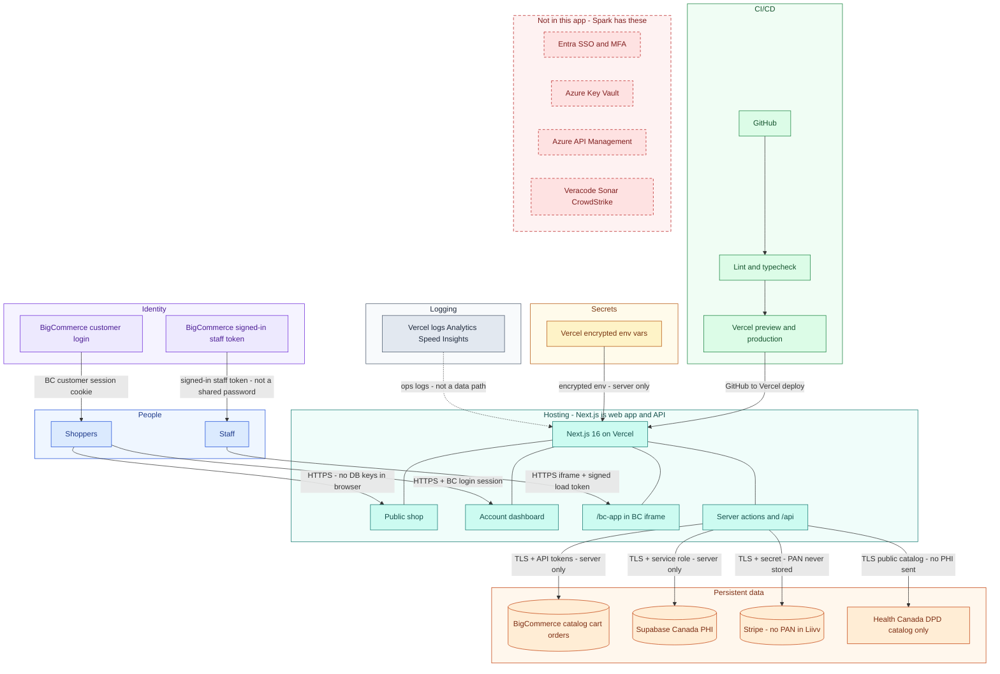
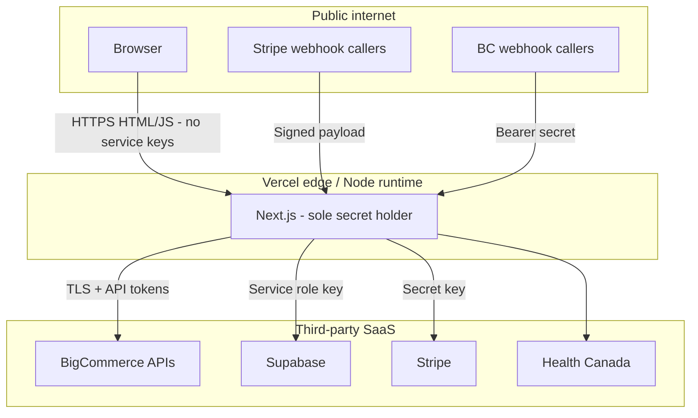
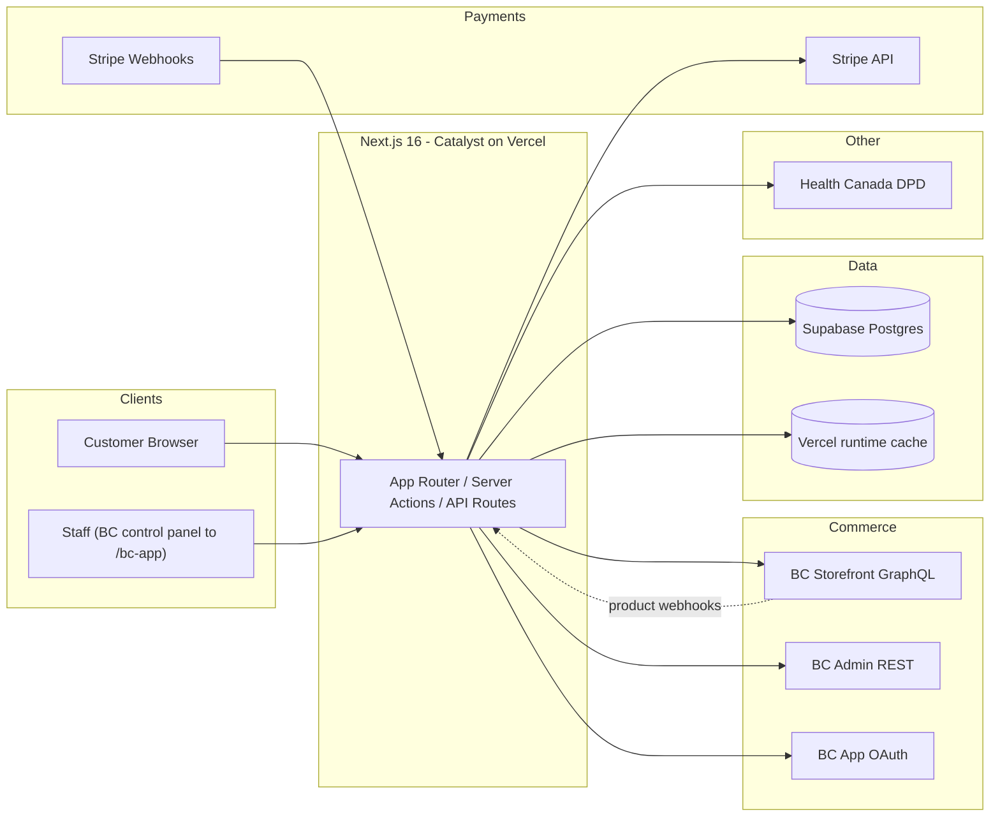
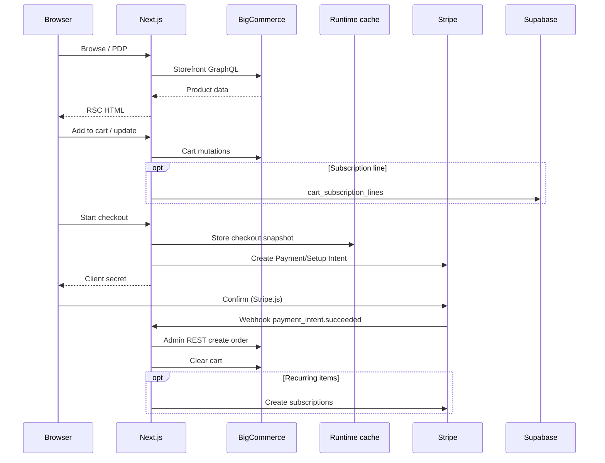
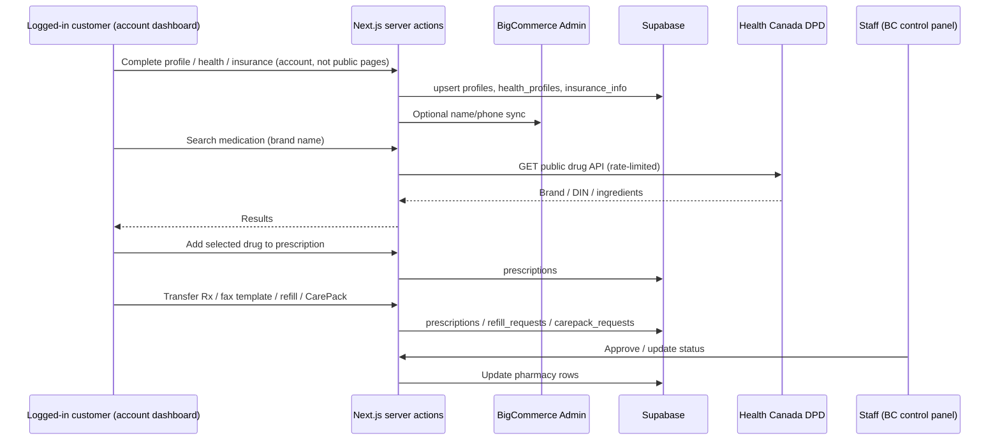
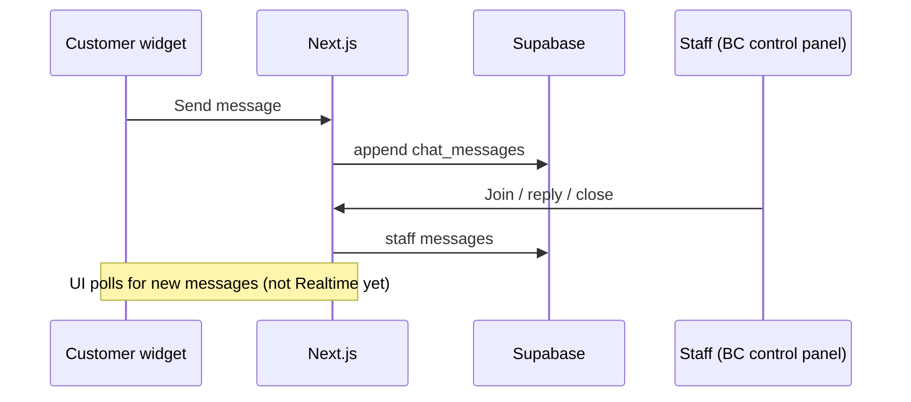

# Liivv — Architecture

**Audience:** IT / security review of the **application** (current stack)  
**App:** Next.js 16 storefront (`core/`) + Liivv health and pharmacy extensions  
**Date:** September 2026  
**Status:** Current — Vercel + BigCommerce + Canadian Supabase + Stripe  

**PDF:** [Liivv-Architecture.pdf](./Liivv-Architecture.pdf)

This is **one** pack for the IT meeting. It describes **today’s** app. It does not describe a future move onto Azure. Spark’s slide is used only as a **vocabulary map**. Where Spark has a box we do not have, that is listed under **not in place** — we do not claim Entra, Key Vault, or Veracode.

---

## 1. What we are asking you to review

Liivv is a **Next.js 16** app (App Router) on **Vercel**. Shoppers see one site. The **browser is not the database client**. Next.js is the only process that holds service-role, admin, and payment secrets.

You are scoring whether **this application** would be a leak or jump-off point: can a shopper or random caller read PHI, fake a payment, or walk into a database with a key from the page?

Liivv is **not** Spark. Spark is an Azure web app → API gateway → microservices → SQL **in the same estate**. Liivv is one Node runtime that calls **vendors** (BigCommerce, Supabase, Stripe) over TLS. Same *idea* as Spark’s “only the API talks to SQL.” Different *platform*. The Spark-shaped **block diagram** is in **§2**.

**Residual (true of Spark too):** if someone steals the **server** secret (Supabase service role, BC admin token, Stripe secret), row rules on the database do not stop them. Mitigation is secret hygiene and never putting those keys in the browser — not “the database cannot be hacked.”

---

## 2. Spark slide → Liivv today

Spark’s diagram is **layers**: people → web app → gateway → services → SQL, plus identity, vault, CI/CD, and scans on the side. Liivv uses the **same layers**. The picture below is that slide drawn for **this** app. Boxes on the right labeled **not in this app** are Spark controls we do **not** have.



**Color:** blue = people · green = CI/CD · teal = Next.js app · purple = identity · amber = secrets · gray = logging · orange = data · red dashed = Spark boxes we do **not** have.

**Arrows:** the text on each hop is how that path is protected (HTTPS/TLS, login or load token, server-only secrets). The browser never holds the database or payment secret.

**How to read it vs Spark:** Spark splits **web app**, **API gateway**, and **backend services**. Liivv is **one** Next.js process: the page, the API, and the only talker to SQL/vendors. Spark’s SQL sits **inside Azure**. Ours sits at **vendors** (Supabase, BigCommerce, Stripe). Identity is **BigCommerce**, not Entra.

| Spark box | Liivv today | Status |
| --- | --- | --- |
| Web app | Next.js 16 on **Vercel** (HTML, account dashboard, `/bc-app`) | **Have** |
| API gateway | **No Azure APIM.** Next.js server actions and `/api/*` are the public API (auth, rate limit, webhook verify) | **Equivalent (app layer)** — not a dedicated gateway product |
| Backend microservices | **One** Node runtime, not a mesh of services | **Have (simpler)** |
| SQL in the estate | **Canadian Supabase Postgres** (PHI). Shop data in **BigCommerce**. Not Azure SQL next to the app | **Have (vendor DB)** — not in-estate SQL |
| Identity / SSO / MFA | **BigCommerce** customer login and BC control-panel login for staff. **No Entra** on Liivv | **Not in place** (Entra). MFA = BC store setting (ops confirm) |
| Key Vault | **Vercel encrypted env vars**. Not Azure Key Vault | **Not in place** (Key Vault) |
| Rate limiting | DPD search: 60 req / IP / min **per serverless instance** | **Partial** — see to address |
| Webhook auth | Stripe signature; BC Bearer secret | **Have** |
| CI/CD | GitHub → **Vercel** preview/production. Lint/typecheck in Catalyst workflows | **Have (Vercel)** — not Spark’s GitHub Enterprise + DACPAC |
| SAST (Veracode, Sonar, CrowdStrike) | **Not in this pipeline** | **Not in place** |
| Logging / App Insights | **Vercel** logs, Analytics, Speed Insights, OpenTelemetry hook. Not Azure Monitor | **Have (Vercel)** — not App Insights |
| Email microservice | **BigCommerce** transactional mail | **Have (vendor)** |

---

## 3. Systems of record

Shoppers see one site. **Commerce and health data use different systems of record.**

- **BigCommerce** — catalog, cart, checkout, orders, customer login, most customer email.
- **Supabase** — Canadian Postgres (`ca-central-1`): profile, insurance, prescriptions, CarePack, care chat.
- **Stripe** — card charges and subscriptions. PAN / CVC **never** stored in Liivv.

Orders are not stored in Supabase. Health records are not stored in BigCommerce.


| Function | System | Boundary |
| --- | --- | --- |
| Catalog, cart, checkout, order of record | BigCommerce | Shop engine — not health records |
| Health profile, insurance, prescriptions, care chat | Supabase | Canadian Postgres — not the shop |
| Card charges and subscriptions | Stripe | Payment processor — PAN / CVC never stored |

| Domain | System of record | Notes |
| --- | --- | --- |
| Storefront hosting | Vercel | Next.js 16 — not a data store of record |
| Products, categories, prices | BigCommerce | Synced to Stripe prices via BC webhooks |
| Customers (login identity) | BigCommerce | Linked in Supabase `profiles.bigcommerce_customer_id` |
| Cart / checkout cart | BigCommerce GraphQL | Cart ID in signed Auth.js / anonymous JWT |
| Orders | BigCommerce | Admin REST after Stripe success |
| Payment methods & subscriptions | Stripe | Renewals create BC orders on `invoice.paid` |
| Health profile, insurance, Rx, CarePack, chat | Supabase | Not modeled in BC; staff queue in `/bc-app` |

**PII** (personally identifiable information) is who they are: name, email, address, BC customer id — BigCommerce + Supabase `profiles`.  
**PHI** is who they are **plus** health: insurance, Rx, CarePack, chat — Supabase only.

Canadian privacy frame is **PIPEDA** (and **PHIPA** in Ontario). HIPAA is a US statute; we do not claim HIPAA because we listed a Canadian region.

---

## 4. Trust boundary

The browser never receives service keys. Next.js on Vercel is the only secret holder.



Vercel is **hosting**, not a system of record. Secrets live in the Vercel project (encrypted) and gitignored `.env.local`.

---

## 5. How the app talks to the database

The browser **never** opens Supabase.

1. Customer or staff hits Next.js (public shop, **`/account/...` dashboard**, or `/bc-app`).
2. Next.js checks the session (Auth.js / BigCommerce customer, or BC signed load token for staff).
3. **Only then** the server uses `SUPABASE_URL` + **service role** ([`core/lib/supabase/client.ts`](../core/lib/supabase/client.ts) is `server-only`).
4. Table access is server modules (profiles, health, insurance, prescriptions, chat) — not a connection string in JavaScript shipped to the shopper.

**Row Level Security (RLS)** is **on**, with **no** anon/authenticated policies (deny by default). That stops a stolen **browser/anon** path from reading tables. The **service role bypasses RLS** — same as Spark’s API using a privileged SQL login. RLS is not “Supabase cannot be hacked.”

PHI forms are **not** on the homepage. Profile, health, insurance, pharmacy, and care chat are in the **logged-in account dashboard**.

---

## 6. Identity and `/bc-app`

| Who | How they get in | What they see |
| --- | --- | --- |
| Customer | BigCommerce login (Auth.js session) | Public shop; after login, account dashboard |
| Anonymous shopper | Signed cart cookie | Catalog and cart only |
| Staff | BigCommerce control panel → **Apps → My apps → Liivv Staff** | Pharmacy queue, customers, chat in `/bc-app` |

`/bc-app` is **one** staff portal, loaded in the BC admin **iframe** with the **signed-in load token**. There is no separate Liivv staff password. `/staff` is 404. `/admin` only redirects to the BigCommerce control panel.

Staff read and update **Supabase** (prescription / refill / CarePack queues, customer pharmacy detail, care chat) — not BigCommerce orders.

**Entra SSO is not wired.** Staff MFA, if any, is whatever the **BigCommerce store** has enabled (ops must confirm in the BC control panel).

---

## 7. Health Canada DPD

The **Drug Product Database** is Health Canada’s **free public API** (open government data — no key, no paid contract). Customers search by brand when adding a prescription in the account dashboard. Next.js **proxies** the call (browser never talks to Health Canada). The **prescription is stored in Supabase**. DPD is a catalog only.

Rate limit: **60 requests / IP / minute**, in memory **per Vercel instance** (not a global counter). See to address.

---

## 8. Risks IT asked about

### In place — the app is designed against this

| Concern | What the app does today |
| --- | --- |
| Shopper or leaked page key reads everyone’s PHI | No database key in the browser. RLS deny-by-default. Server talks to Supabase only after a session check. |
| Fake “payment succeeded” creates an order | Stripe webhook verified with `STRIPE_WEBHOOK_SECRET`. |
| Fake BigCommerce product webhook | `Authorization: Bearer` + `BIGCOMMERCE_WEBHOOK_SECRET`. |
| Site used as an open pipe to Health Canada | Server proxy; 60/IP/min per instance. |
| Staff portal is a public app with a shared password | `/bc-app` + BC signed-in token. `/staff` is 404. |
| Card numbers in our database | Stripe Elements. PAN / CVC never stored. |
| PHI stored in BigCommerce | Health rows only in Canadian Supabase. |
| Rx photo uploads as a dump of images | Not collected. Transfer or doctor fax only. |

### Not in place — list so we can address (we do not have these)

| ID | Gap | Today | Owner |
| --- | --- | --- | --- |
| G1 | **Entra SSO / MFA on Liivv** | BigCommerce identity only | Engineering (if required) + **BC store admin** to confirm store MFA |
| G2 | **Azure Key Vault** | Vercel env vars | Engineering / ops |
| G3 | **Separate Preview vs Production secrets** | Historically the **same** keys | Engineering / ops |
| G4 | **Azure API Management / dedicated WAF** | Vercel edge + Next.js routes | Engineering / IT if hosting standard requires APIM |
| G5 | **Veracode / Sonar / CrowdStrike** | Not in this repo’s pipeline | Engineering / IT |
| G6 | **Supabase network allowlist** (Vercel egress only) | **Not configured.** We rely on no browser key + RLS | Engineering |
| G7 | **Global DPD rate limit** | Per-instance memory, not one shared counter | Engineering |
| G8 | **Vendor DPAs / BAAs** | Not asserted here | **Legal** |
| G9 | **Backup / RPO** for Supabase | No Liivv runbook in this pack | **Ops** / Legal |
| G10 | **Chat-body logging policy** | Not claimed as enforced in code | Engineering + ops |
| G11 | **AI chat assistant** | Flag **off**. Not active in production | Product + Legal |
| G12 | **Makeswift** | Still in the codebase. CSP allowlists Makeswift **only if** `MAKESWIFT_SITE_API_KEY` is set | Engineering |

---

## 9. Other systems (short)

**BigCommerce** is the only store engine: catalog, cart, checkout, official order, customer login, most email. Recurring: Stripe bills; Liivv still creates the order in BigCommerce.

**AI chat assistant** (Olivia) is **off** (`VIRTUAL_CARE_BOT_ENABLED`). Human care chat stays in Supabase via `/bc-app`.

---

## 10. System context



---

## 11. Data flows

### Commerce



### Account dashboard — onboarding and pharmacy



### Care chat



---

## 12. Controls S1–S8

Gaps Spark has and we do not are in **§8**, not dressed as “in place.”

| ID | Topic | If left unchecked | Status | Control |
| --- | --- | --- | --- | --- |
| **S1** | Who can query Supabase | High | **In place** | RLS on; **no** anon/authenticated policies. No DB key in the browser. Service role on the server bypasses RLS by design. Network allowlist is **G6**. |
| **S2** | Where health data lives | High | **In place** | PHI in **Canadian** Supabase. Transfer or fax only. DPA/BAA is **G8**. |
| **S3** | Staff access | Med | **In place** | `/bc-app` + signed-in load token. `/staff` is 404. Entra is **G1**. |
| **S4** | AI chat assistant | Med | **Off** | `VIRTUAL_CARE_BOT_ENABLED=false`. Not active in production. |
| **S5** | Environment secrets | Med | **Partial** | Vercel env + gitignored `.env.local`. Not Key Vault (**G2**). Preview/Production keys historically matched (**G3**). |
| **S6** | Embedded staff app frames | Med | **In place** | iframe cookies `SameSite=None; Secure`. CSP allowlisted. Makeswift only if API key set (**G12**). |
| **S7** | Customer email | Low | **In place** | BigCommerce transactional mail. |
| **S8** | Medication search (DPD) | Low | **Partial** | Server proxy. 60/IP/min **per instance** (**G7**). |

Also: webhooks verified; BC app session bound to store hash; cart ID in a signed JWT.

---

## 13. Auth cookies and secrets

| Plane | Mechanism | Cookie | Secret | Path / lifetime |
| --- | --- | --- | --- | --- |
| Customer | NextAuth → BC GraphQL login or Customer Login JWT | Auth.js session JWT | `AUTH_SECRET` | Site-wide |
| Anonymous cart | Signed JWT containing `cartId` | `authjs.anonymous-session-token` | `AUTH_SECRET` | 7 days |
| Staff (BC app) | OAuth install + signed load | `liivv_bc_app` | `BIGCOMMERCE_APP_CLIENT_SECRET` | `/bc-app`, 12 hours |

**Webhooks:** Stripe `constructEvent` + `STRIPE_WEBHOOK_SECRET`. BigCommerce `Authorization: Bearer` + `BIGCOMMERCE_WEBHOOK_SECRET`.

| Secret | Purpose |
| --- | --- |
| `AUTH_SECRET` | Auth.js + anonymous cart JWT |
| `BIGCOMMERCE_STOREFRONT_TOKEN` | Storefront GraphQL |
| `BIGCOMMERCE_ACCESS_TOKEN` | Admin REST (orders, customers) |
| `BIGCOMMERCE_CLIENT_ID` / `CLIENT_SECRET` | Customer Login API JWT |
| `BIGCOMMERCE_WEBHOOK_SECRET` | Product → Stripe sync |
| `BIGCOMMERCE_APP_CLIENT_ID` / `SECRET` | Embedded staff app |
| `STRIPE_SECRET_KEY` / `STRIPE_WEBHOOK_SECRET` | Payments |
| `NEXT_PUBLIC_STRIPE_PUBLISHABLE_KEY` | **Public** — Stripe.js only |
| `SUPABASE_URL` / `SUPABASE_SERVICE_ROLE_KEY` | DB (bypasses RLS) |
| `MAKESWIFT_SITE_API_KEY` | Leftover — if set, CSP allowlists Makeswift |

---

## 14. Evidence paths (code)

```
core/package.json
.env.example
core/auth/index.ts
core/lib/supabase/client.ts
core/lib/supabase/onboarding-schema.sql
core/lib/supabase/pharmacy-schema.sql
core/lib/bc-app-session.ts
core/lib/staff-access.ts
core/lib/content-security-policy.ts
core/lib/pharmacy/medication-rate-limit.ts
core/lib/stripe/webhook-handlers.ts
core/lib/virtual-care-bot/
core/app/api/medications/
core/app/api/stripe/webhook/route.ts
core/app/api/bigcommerce/webhook/route.ts
core/app/api/bigcommerce/app/{auth,load,uninstall}/route.ts
core/app/bc-app/
```
