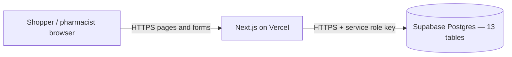
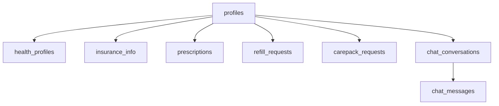

# Liivv — Supabase inventory

**For:** IT / security  
**From:** Liivv  
**Date:** 9 September 2026  
**Ask:** “Please provide all the tables, backend / Edge Functions on Supabase.”  
**PDF:** [Supabase-Inventory.pdf](./Supabase-Inventory.pdf)

---

## Direct answer

| Item | What Liivv has |
| --- | --- |
| **Tables** | **13** Postgres tables in the `public` schema (listed below) |
| **Supabase Edge Functions** | **None** |
| **Supabase database functions / triggers / cron** | **None** in the application schema |
| **Supabase Auth / Storage / Realtime** | **Not used** by the app |

Supabase is used as a **hosted Postgres database** in **Canada** (`ca-central-1`). Application logic runs in the **Next.js storefront on Vercel**, not as serverless functions inside Supabase.

The browser never holds a Supabase key and never calls Supabase directly.

---

## What “backend / Edge Functions” means here

In Supabase, **Edge Functions** are optional Deno serverless APIs you deploy *inside* the Supabase project (Dashboard → Edge Functions, or a `supabase/functions/` folder in git). Typical uses: webhooks, scheduled jobs, custom APIs.

Liivv does **not** use that product.

| Kind of “backend” | Hosted where | Used by Liivv? |
| --- | --- | --- |
| Supabase Edge Functions | Supabase | **No — none deployed, none in the repo** |
| Postgres stored procedures / triggers | Supabase SQL | **No** for application tables |
| Next.js server code (pages, server actions, `/api/*`) | Vercel | **Yes — this is the application backend** |

Webhooks (Stripe, BigCommerce) hit **Next.js routes on Vercel**, for example `/api/stripe/webhook` and `/api/bigcommerce/webhook`. They do not hit Supabase functions.

---

## How the app connects

| Fact | Detail |
| --- | --- |
| Region | Canada Central (`ca-central-1`) |
| Product used | Postgres + PostgREST HTTPS API |
| Client | Server-only module `core/lib/supabase/client.ts` |
| Credentials | `SUPABASE_URL` and `SUPABASE_SERVICE_ROLE_KEY` (Vercel env vars; never in the browser) |
| Auth on tables | Documented control: **Row Level Security on**, with **no** anon/authenticated policies (deny by default). The service role **bypasses** RLS by design — same class of risk as a privileged SQL login on an API. |

Schema source (run in the Supabase SQL editor):

1. `core/lib/supabase/schema.sql`
2. `core/lib/supabase/onboarding-schema.sql`
3. `core/lib/supabase/pharmacy-schema.sql`

---

## Tables (complete list)

### Health and pharmacy (PHI / PII)

| Table | Purpose | Data class | Key fields |
| --- | --- | --- | --- |
| `profiles` | One Liivv profile per BigCommerce customer | PII | `id` (uuid), `bigcommerce_customer_id` (unique), name, email, phone, onboarding timestamps, `care_interests` |
| `health_profiles` | Care questionnaire (diabetes, ostomy, catheter, wound, respiratory, clinician contacts) | PHI | `id`, `profile_id` → `profiles` (1:1), medications, allergies, device brands, `care_details` (jsonb) |
| `insurance_info` | Insurance card details | PHI | `id`, `profile_id` → `profiles`, provider, policy/group/member ids, `card_image_url` (column exists; app does not use Supabase Storage) |
| `prescriptions` | Customer prescriptions | PHI | `id`, `profile_id` → `profiles`, medication, DIN, dosage, dates, status, approval, notes |
| `refill_requests` | Pharmacist refill queue | PHI | `id`, `profile_id` → `profiles`, `prescription_ids` (uuid[]), status, notes |
| `carepack_requests` | Pharmacist CarePack queue | PHI | `id`, `profile_id` → `profiles`, `prescription_ids` (uuid[]), status, notes |
| `chat_conversations` | One care-chat thread per profile | PHI (operational) | `id`, `profile_id` → `profiles` (unique), staff join/close/escalate timestamps |
| `chat_messages` | Care-chat messages | PHI | `id`, `conversation_id` → `chat_conversations`, `sender_type` (`customer` / `staff` / `bot` / `system`), `body` (max 8000 chars) |

`profiles` is the parent. Deleting a profile **cascades** to health, insurance, prescriptions, refill/CarePack requests, and chat.

### Shop / subscription operations (not modeled as PHI)

| Table | Purpose | Data class | Key fields |
| --- | --- | --- | --- |
| `cart_subscription_lines` | Subscription line metadata on a cart (survives restarts) | Operational | `cart_id` (pk), `lines` (jsonb) |
| `cart_kit_sessions` | Build-your-own kit composition for packing notes | Operational | `cart_id` (pk), `kits` (jsonb) |
| `saved_kits` | Customer-saved custom kits | Operational | `id`, `bigcommerce_customer_id`, name, `fingerprint`, `items` (jsonb) |
| `subscription_order_batches` | Paid Stripe invoice lines waiting to combine into one BigCommerce order | Operational | `storage_key` (pk), `customer_id`, shipment day/address, `items` (jsonb) |
| `finalized_shipment_records` | Past subscription shipment history | Operational | `storage_key` (pk), `customer_id`, outcome, `bigcommerce_order_id`, charged/skipped items (jsonb) |

Orders, products, and shopper login identity live in **BigCommerce**, not these tables. Card numbers live in **Stripe**, never in Supabase.

---

## Relationships (health)

Shop tables (`cart_*`, `saved_kits`, `subscription_order_batches`, `finalized_shipment_records`) are keyed by BigCommerce cart id or customer id. They do not foreign-key to `profiles`.

---

## What is *not* on Supabase

| Feature | Status |
| --- | --- |
| Edge Functions | None |
| Database functions / stored procedures | None in application schema |
| Triggers | None in application schema |
| `pg_cron` / scheduled jobs | None |
| Supabase Auth (user accounts) | Not used — shopper login is BigCommerce |
| Storage buckets | Not used — `avatar_url` / `card_image_url` columns exist but files are not stored in Supabase Storage |
| Realtime subscriptions | Not used |
| Shop catalog, orders, payments | BigCommerce + Stripe |

---

## Confirm in the Supabase dashboard

This inventory is from the **application schema in git**. Please also confirm in the live project:

1. **Database → Tables** — the 13 tables above (no extras unexpected by Liivv)
2. **Edge Functions** — empty
3. **Database → Functions / Triggers** — no application functions
4. **Authentication / Storage** — unused by the storefront
5. **RLS** — enabled on these tables, with no policies for `anon` / `authenticated`

If the live project has extra tables or functions not listed here, they are not part of the Liivv storefront codebase.
